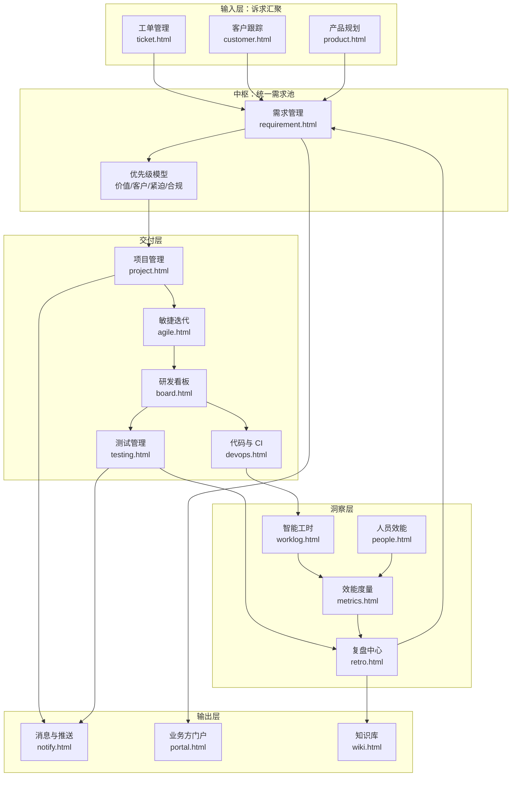
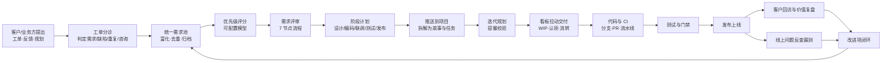

# DevFlow 研发管理平台 · 产品需求文档（PRD）

> 本文是 DevFlow 研发管理平台的主 PRD。与之配套的高保真原型位于仓库根目录（24 个 HTML 页面），文中所有状态、字段、规则、算法均与原型实现保持一致，可对照验收。

## 文档信息

| 项 | 内容 |
| --- | --- |
| 文档名称 | DevFlow 研发管理平台产品需求文档 |
| 版本 | V1.0 |
| 状态 | 评审中 |
| 产品负责人 | 研发中心总裁办 · 产品部 |
| 覆盖范围 | 需求管理、工单与客户、产品管理、项目与敏捷、研发看板、测试管理、代码与 CI、智能工时、人员效能、效能度量、复盘、消息推送、知识库、业务方门户、系统设置 |
| 配套文档 | [用户故事与验收标准](prd/user-stories.md) · [状态机设计](prd/state-machines.md) · [数据模型与 ER 图](prd/data-model.md) · [业务流程与流转图](prd/flows.md) · [指标口径字典](prd/metrics.md) |
| 配套原型 | 仓库根目录 `index.html` 起，或见 [附录 B](#附录-b原型页面与需求条目对照) |

### 版本历史

| 版本 | 主要变更 | 状态 |
| --- | --- | --- |
| V0.1 | 明确问题域与业务闭环，产出信息架构与高保真原型 | 已完成 |
| V0.5 | 补充敏捷、多渠道需求、客户跟踪、自动工时、复盘、对外门户 | 已完成 |
| V0.8 | 补充阶段计划、企业微信推送、漏测反查、人效与产品贡献 | 已完成 |
| V1.0 | 形成完整 PRD：状态机、ER、流程、用户故事、指标口径、非功能与集成 | 评审中 |

### 术语表

| 术语 | 定义 |
| --- | --- |
| 工作项 Work Item | 平台内可被跟踪的最小交付单元的统称，含 Epic / 需求 / 用户故事 / 任务 / 缺陷 / 技术债 / 测试用例 |
| DoR / DoD | Definition of Ready / Done，工作项进入或离开某状态的准入、准出条件 |
| WIP | Work In Progress，在制品数量；看板每列可设上限 |
| 周期时间 Cycle Time | 工作项从进入"开发中"到进入"已完成"的时长 |
| 前置时间 Lead Time | 需求从提出到上线的时长 |
| 流动效率 | 增值时间 ÷ 总周期时间 |
| 漏测（逃逸缺陷） | 未在测试阶段发现、上线后由用户或线上监控暴露的缺陷 |
| 代码当量 | 按语言与复杂度加权后的等效代码变更量，用于推算编码工时 |
| 客户呼声 | 同一需求背后关联的客户数量与客户等级加权值 |
| 阶段计划 | 需求级的设计 / 编码 / 联调 / 测试 / 发布五段计划与实际日期 |

---

## 一、背景与问题

### 1.1 现状

研发中心当前规模为 96 人、5 条产品线、9 个在研项目、36 家企业客户。管理链路依赖多个割裂的工具：需求在表格里、工单在客服系统里、任务在项目工具里、代码在 GitHub、进度靠周报、工时靠手填。由此产生六个反复出现的管理问题：

1. **需求来源分散且无统一池**：工单、客户反馈、产品规划三类来源各自记录，同一诉求重复立项，客户提了什么、做到哪一步无人能完整回答。
2. **优先级靠嗓门**：没有公开的评分模型，排期结论无法向业务方解释，插入需求频繁冲击迭代承诺。
3. **进度对非研发不可见**：业务方与客户经理只能通过人工问询获取进展，研发被打断，信息还经常过时。
4. **工时数据不可信**：手工填报滞后且失真，导致成本核算与容量规划都建立在错误数据上。
5. **质量问题事后无归因**：线上问题频发但说不清是"测试没设计用例"还是"这轮没执行"，改进无法沉淀。
6. **人效无法衡量**：无法回答"某人对某条产品线贡献多少""哪些模块存在单点依赖"。

### 1.2 产品定位

DevFlow 是面向中大型软件研发组织的**一体化研发管理平台**：以统一需求池为中枢，向上承接客户与业务诉求，向下打通项目、代码、测试与发布，用自动采集的过程数据支撑效能度量与成本核算，并向非研发角色开放只读的进度视图。

### 1.3 目标与成功指标

| 目标 | 关键结果（上线后一个完整季度内） |
| --- | --- |
| 需求来源统一可追溯 | 工单转需求自动关联率 ≥ 95%；每条需求可反查来源单号与客户 |
| 排期决策可解释 | 100% 排期需求带优先级得分与因素拆解；插入需求需走准入规则 |
| 进度自动可见 | 业务方门户日活覆盖 ≥ 60% 的业务干系人；人工问询进度的沟通量下降 50% |
| 工时数据可信 | 自动推算工时归集率 ≥ 90%，成员调整幅度中位数 ≤ 15% |
| 质量问题可归因 | 100% 生产缺陷完成漏测反查并落到责任环节；漏测率季度环比下降 |
| 交付效率可观测 | DORA 四项指标每周自动出数，无人工汇总 |

### 1.4 非目标（Out of Scope）

以下内容明确不在本期范围内，避免边界蔓延：

- 不做通用 IM、不做办公审批流（OA）、不做人事考勤与薪酬
- 不做代码托管本身（继续使用 GitHub），只做集成与聚合展示
- 不做 CI/CD 执行引擎（继续使用 GitHub Actions），只做编排结果的聚合与门禁判定
- 不做客户合同、报价与回款（CRM 侧能力），只做客户与需求/工单的关联视图
- 工时数据**不作为**个人绩效考核的直接依据（见 5.4 数据使用原则）

---

## 二、目标用户与角色

### 2.1 角色画像

| 角色 | 代表人物 | 核心诉求 | 高频页面 |
| --- | --- | --- | --- |
| 研发中心总裁 / VP | 沈知远 | 组织整体健康度、投入产出、风险早发现 | 工作台、效能度量、人员效能 |
| 产品总监 / 产品经理 | 周雅、孙悦 | 需求池质量、优先级可解释、路线图对外可用 | 需求管理、产品管理、工单清洗 |
| 项目经理 / Scrum Master | 徐磊 | 迭代承诺达成、资源与容量、风险与依赖 | 项目管理、敏捷迭代、研发看板 |
| 技术负责人 / 架构师 | 李思远、陈立 | 技术方案评审、技术债、系统稳定性 | 研发看板、代码与 CI、测试管理 |
| 研发工程师 | 何俊、王倩、林小满 | 今天该做什么、少填表、上下文集中 | 我的工作、研发看板、代码与 CI |
| 测试工程师 / 测试经理 | 吴敏 | 用例与需求对齐、质量门禁、漏测归因 | 测试管理、缺陷看板 |
| 客服 / 客户经理 | 赵鹏 | 工单 SLA、客户诉求进展、对客承诺 | 工单管理、客户跟踪、门户 |
| 业务方 / 客户（只读） | 外部干系人 | 我提的需求做到哪了、什么时候上线 | 业务方门户 |

### 2.2 角色与权限模型

平台采用 **RBAC + 数据范围** 双层控制：角色决定能做什么操作，数据范围（空间 / 产品线 / 项目 / 本人）决定能看到哪些数据。

| 权限项 | 超管 | 空间管理员 | 项目管理员 | 成员 | 访客 |
| --- | :-: | :-: | :-: | :-: | :-: |
| 查看需求 / 项目 | ✓ | ✓ | ✓ | ✓ | ✓ |
| 创建 / 编辑工作项 | ✓ | ✓ | ✓ | ✓ | — |
| 删除工作项 | ✓ | ✓ | ✓ | — | — |
| 需求评审与审批 | ✓ | ✓ | — | — | — |
| 项目与迭代配置 | ✓ | ✓ | ✓ | — | — |
| 成员与权限管理 | ✓ | ✓ | — | — | — |
| 集成与工作流配置 | ✓ | — | — | — | — |
| 查看效能度量 | ✓ | ✓ | ✓ | — | — |
| 导出数据 | ✓ | ✓ | — | — | — |
| 门禁豁免审批 | ✓ | — | — | — | — |

补充规则：

- **状态操作权限**独立于角色矩阵，按状态配置可操作角色（详见 [状态机文档](prd/state-machines.md#附状态操作权限)）。
- **个人工时明细**仅本人与直属主管可见；团队级汇总对管理者公开。
- **敏感字段脱敏**：商户信息、交易金额按角色脱敏展示，导出需二次审批并留痕。
- **外部门户**为独立只读身份，只能看到被显式标记为"对外可见"的需求、版本与路线图条目。

---

## 三、范围与产品结构

### 3.1 模块地图



### 3.2 功能范围（本期 In Scope）

| 编号 | 模块 | 范围要点 | 优先级 |
| --- | --- | --- | --- |
| M1 | 工单管理 | 多渠道受理、7 类可配置工单类型、SLA 时钟与升级、工单池分诊、转需求/缺陷 | Must |
| M2 | 客户跟踪 | 客户 360、客户等级与权重、呼声矩阵、对客承诺跟踪 | Must |
| M3 | 需求管理 | 统一需求池、富化清洗归档、可配置优先级模型、评审流程、阶段计划、需求拆解 | Must |
| M4 | 产品管理 | 产品清单与详情、多视角路线图、版本与发布就绪度、对外同步 | Must |
| M5 | 项目管理 | 项目组合、多版本迭代规划、资源排期与容量、任务池自助认领 | Must |
| M6 | 敏捷迭代 | 站会看板、迭代节奏、规划扑克、迭代健康雷达、跨团队依赖 | Should |
| M7 | 研发看板 | 范围选择器、5 类看板、WIP 与列策略、泳道、卡片老化与阻塞、看板度量 | Must |
| M8 | 测试管理 | 用例库、测试计划与执行、缺陷管理、质量门禁、漏测反查分析 | Must |
| M9 | 代码与 CI | GitHub 集成、分支与 PR、流水线与日志、环境部署与回滚、代码质量 | Must |
| M10 | 智能工时 | 提交自动推算、归集与分摊、成员确认、成本核算 | Must |
| M11 | 人员效能 | 六维效能画像、产品贡献率矩阵、单点依赖识别、人才象限 | Should |
| M12 | 效能度量 | DORA、交付效率、质量、人效与成本四层指标 | Must |
| M13 | 复盘中心 | 四类复盘、回顾看板模板、行动项 SMART 校验与闭环跟踪 | Should |
| M14 | 消息与推送 | 企业微信集成、24 条推送规则、模板与订阅、推送效果分析 | Must |
| M15 | 知识库 | 文档空间、模板、与工作项互链 | Could |
| M16 | 业务方门户 | 对外只读进度、需求提交、路线图公开、订阅 | Should |
| M17 | 系统设置 | 集成中心、成员权限、工作项类型与状态机、字段、自动化规则、安全审计 | Must |

### 3.3 版本切分

按能力闭环切分为三个发布批次，每批次都必须自身可用（而不是"半个链路"）。

| 批次 | 主题 | 包含模块 | 准出条件 |
| --- | --- | --- | --- |
| R1 | 打通"诉求 → 需求 → 交付"主干 | M1 M2 M3 M5 M7 M9 M17 | 一条真实需求可从工单进入、评分排期、拆解到看板、关联 PR 并上线 |
| R2 | 质量与自动化 | M4 M6 M8 M10 M14 | 提测到发布全链路带门禁；工时自动归集率达标；关键节点自动推送 |
| R3 | 度量与对外 | M11 M12 M13 M15 M16 | DORA 与漏测指标自动出数；业务方门户对外开放并有订阅 |

---

## 四、核心业务流程

完整流程图（含泳道图、自动流转、集成时序）见 [业务流程与流转图](prd/flows.md)。此处给出端到端主干：



关键设计原则：

1. **单一事实来源**：需求池是唯一的需求入口，任何来源都必须落成需求记录，禁止"口头需求直接进迭代"。
2. **自动优先于填报**：能从 GitHub、CI、日历、工作项流转中自动采集的数据，一律不让人填。
3. **状态由事件驱动**：状态变更尽量由客观事件触发（创建分支、提 PR、合并、用例通过），人工流转是兜底而非主路径。
4. **可解释性**：排期结论、优先级得分、漏测判定、工时推算都必须能展开看到计算依据。

---

## 五、功能需求

完整的用户故事与验收标准见 [用户故事文档](prd/user-stories.md)，此处列出功能需求条目（FR）总表与关键规则说明。

### 5.1 功能需求总表

| FR 编号 | 模块 | 需求描述 | 优先级 | 用户故事 |
| --- | --- | --- | --- | --- |
| FR-TK-01 | 工单 | 多渠道工单受理与列表化管理，支持客户关联 | Must | [US-TK-01](prd/user-stories.md#epic-1-工单受理与分诊) |
| FR-TK-02 | 工单 | 工单类型可自定义（专属字段、默认 SLA、默认处理组、可转换目标） | Must | US-TK-02 |
| FR-TK-03 | 工单 | SLA 时钟、剩余量预警与超时自动升级 | Must | US-TK-03 |
| FR-TK-04 | 工单 | 工单池分诊：相似度聚类、六类判定、批量处理 | Must | US-TK-04 |
| FR-TK-05 | 工单 | 工单转需求 / 缺陷 / 知识库，保留双向溯源 | Must | US-TK-05 |
| FR-CU-01 | 客户 | 客户 360 视图（工单、需求、承诺、健康度） | Must | US-CU-01 |
| FR-CU-02 | 客户 | 客户呼声矩阵，支持按等级加权排序 | Should | US-CU-02 |
| FR-CU-03 | 客户 | 对客承诺登记与临期提醒 | Should | US-CU-03 |
| FR-RQ-01 | 需求 | 统一需求池，五类来源合流并保留来源单号 | Must | [US-RQ-01](prd/user-stories.md#epic-2-需求池与优先级) |
| FR-RQ-02 | 需求 | 需求富化（AI 补全背景/收益/验收标准/客户影响面） | Should | US-RQ-02 |
| FR-RQ-03 | 需求 | 重复需求识别与合并，客户影响面叠加 | Should | US-RQ-03 |
| FR-RQ-04 | 需求 | DoR 就绪度检查，未达标不允许进入评审与排期 | Must | US-RQ-04 |
| FR-RQ-05 | 需求 | 可配置优先级模型（因素、权重、算法、版本化） | Must | US-RQ-05 |
| FR-RQ-06 | 需求 | 需求评审流程（7 节点、SLA、准入准出、价值评审会） | Must | US-RQ-06 |
| FR-RQ-07 | 需求 | 阶段计划：设计/编码/联调/测试/发布的计划与实际 | Must | US-RQ-07 |
| FR-RQ-08 | 需求 | 需求拆解为用户故事与任务，支持模板与继承 | Must | US-RQ-08 |
| FR-RQ-09 | 需求 | 需求推送到项目管理，生成工作项并回写关联 | Must | US-RQ-09 |
| FR-RQ-10 | 需求 | 需求归档库，暂缓/不做的需求可检索与复活 | Should | US-RQ-10 |
| FR-PD-01 | 产品 | 产品清单与产品详情（能力模块、指标、配置） | Must | [US-PD-01](prd/user-stories.md#epic-3-产品与路线图) |
| FR-PD-02 | 产品 | 多视角路线图（时间轴/版本/迭代/里程碑/Now-Next-Later） | Must | US-PD-02 |
| FR-PD-03 | 产品 | 路线图条目关联客户反馈，可查看背后客户 | Should | US-PD-03 |
| FR-PD-04 | 产品 | 路线图选择性对外同步到门户 | Should | US-PD-04 |
| FR-PJ-01 | 项目 | 项目组合视图与项目详情 | Must | [US-PJ-01](prd/user-stories.md#epic-4-项目与迭代) |
| FR-PJ-02 | 项目 | 多版本迭代规划板，并行规划 Backlog 与多个 Sprint | Must | US-PJ-02 |
| FR-PJ-03 | 项目 | 资源排期与容量（基线扣减、冲突检测、超载告警） | Must | US-PJ-03 |
| FR-PJ-04 | 项目 | 任务池与自助认领（技能匹配、认领即分配） | Must | US-PJ-04 |
| FR-AG-01 | 敏捷 | 每日站会看板（昨天/今天/阻塞） | Should | US-AG-01 |
| FR-AG-02 | 敏捷 | 规划扑克估算 | Could | US-AG-02 |
| FR-AG-03 | 敏捷 | 迭代健康雷达与跨团队依赖图 | Should | US-AG-03 |
| FR-BD-01 | 看板 | 范围选择器：全部/按产品线/按项目/按团队，记忆与深链 | Must | [US-BD-01](prd/user-stories.md#epic-5-研发看板) |
| FR-BD-02 | 看板 | 五类看板（迭代/需求/缺陷/发布/我的），列与字段自适应 | Must | US-BD-02 |
| FR-BD-03 | 看板 | WIP 上限、超限告警、跨项目按"项目+列"判定 | Must | US-BD-03 |
| FR-BD-04 | 看板 | 列策略（准入 Ready / 准出 Done）显性化 | Must | US-BD-04 |
| FR-BD-05 | 看板 | 泳道（项目/产品线/需求/优先级/经办人），P0 加急泳道 | Should | US-BD-05 |
| FR-BD-06 | 看板 | 卡片老化、阻塞可视化、拉取信号 | Must | US-BD-06 |
| FR-BD-07 | 看板 | 看板度量（CFD、周期时间散点、停留时长、健康诊断） | Should | US-BD-07 |
| FR-TS-01 | 测试 | 用例库与需求-用例覆盖矩阵 | Must | [US-TS-01](prd/user-stories.md#epic-6-测试与质量) |
| FR-TS-02 | 测试 | 测试计划与执行，结果回写工作项 | Must | US-TS-02 |
| FR-TS-03 | 测试 | 缺陷生命周期与 SLA | Must | US-TS-03 |
| FR-TS-04 | 测试 | 质量门禁与豁免审批 | Must | US-TS-04 |
| FR-TS-05 | 测试 | 漏测反查：线上工单/生产缺陷反向评估测试有效性 | Must | US-TS-05 |
| FR-DV-01 | 代码 | GitHub App 集成（仓库、分支、PR、Webhook） | Must | [US-DV-01](prd/user-stories.md#epic-7-代码与持续交付) |
| FR-DV-02 | 代码 | 提交与工作项自动关联（编号约定 + 分支约定） | Must | US-DV-02 |
| FR-DV-03 | 代码 | 流水线状态聚合与失败通知 | Must | US-DV-03 |
| FR-DV-04 | 代码 | 环境部署与回滚记录 | Should | US-DV-04 |
| FR-WL-01 | 工时 | 基于提交/PR/CI/日历自动推算工时 | Must | [US-WL-01](prd/user-stories.md#epic-8-智能工时与成本) |
| FR-WL-02 | 工时 | 按工作项编号自动归集到需求与项目 | Must | US-WL-02 |
| FR-WL-03 | 工时 | 成员确认与调整（±30%），未确认提醒 | Must | US-WL-03 |
| FR-WL-04 | 工时 | 成本核算与未归集工时治理 | Should | US-WL-04 |
| FR-PE-01 | 人效 | 个人六维效能画像 | Should | [US-PE-01](prd/user-stories.md#epic-9-人效与度量) |
| FR-PE-02 | 人效 | 产品贡献率矩阵与单点依赖识别 | Should | US-PE-02 |
| FR-MT-01 | 度量 | DORA 四项指标自动出数 | Must | US-MT-01 |
| FR-MT-02 | 度量 | 交付效率、质量、人效与成本三层指标 | Must | US-MT-02 |
| FR-MT-03 | 度量 | 指标口径公开与治理（定义、来源、更新频率） | Should | US-MT-03 |
| FR-RT-01 | 复盘 | 四类复盘（迭代/版本/故障/项目）与模板 | Should | [US-RT-01](prd/user-stories.md#epic-10-复盘与改进) |
| FR-RT-02 | 复盘 | 匿名反馈、投票排序、现场讨论模式 | Should | US-RT-02 |
| FR-RT-03 | 复盘 | 行动项 SMART 校验与闭环跟踪 | Must | US-RT-03 |
| FR-NT-01 | 推送 | 企业微信集成（应用消息、群机器人） | Must | [US-NT-01](prd/user-stories.md#epic-11-消息与对外可见) |
| FR-NT-02 | 推送 | 24 条推送规则可配置（WHEN / WHO / 渠道 / 时机） | Must | US-NT-02 |
| FR-NT-03 | 推送 | 消息模板与卡片预览、订阅与免打扰 | Should | US-NT-03 |
| FR-PO-01 | 门户 | 对外只读进度（需求、工单、版本迭代） | Must | US-PO-01 |
| FR-PO-02 | 门户 | 对外路线图（Now/Next/Later），标记用户提交的特性 | Should | US-PO-02 |
| FR-ST-01 | 设置 | 工作项类型与颗粒度配置（7 类，含专属属性） | Must | [US-ST-01](prd/user-stories.md#epic-12-系统配置) |
| FR-ST-02 | 设置 | 状态机可视化配置（按工作项类型） | Must | US-ST-02 |
| FR-ST-03 | 设置 | 自定义字段与自动化规则 | Should | US-ST-03 |
| FR-ST-04 | 设置 | 安全与审计（脱敏、导出审批、操作留痕） | Must | US-ST-04 |

### 5.2 关键规则：优先级模型

需求排序不是拍脑袋，而是**可配置、可解释、可版本化**的评分模型。默认算法为"加权价值 ÷ 工作量系数"，另内置 RICE、WSJF、纯加权求和与自定义表达式四种。

**默认算法公式：**

```
加权价值   = Σ( 因素分 × 权重 )
工作量系数 = 1 + 预估人日 ÷ 20
优先级得分 = 加权价值 × 2 ÷ 工作量系数
```

**因素定义（权重合计 100）：**

| 因素 | 权重 | 取值来源 | 方向 |
| --- | --: | --- | --- |
| 业务价值 | 30 | 人工打分 + 收益量化自动校验 | 正向 |
| 客户权重 | 20 | 自动：客户呼声数 × 客户等级系数（战略×3 / KA×2 / 普通×1） | 正向 |
| 团队目标支持度 | 15 | 人工：与季度 OKR 对齐度 | 正向 |
| 紧迫性 | 15 | 自动：承诺日期 / 合规窗口 + 人工修正 | 正向 |
| 竞品对标 | 10 | 人工：竞品覆盖度与差距 | 正向 |
| 风险与合规 | 10 | 规则：合规类自动置 100 | 正向 |
| 工作量（成本） | — | 自动：研发预估人日，作为除数 | 反向 |

**强制规则**：命中"监管合规"来源或"风险与合规"因素满分的需求，跳过评分直接置顶，但仍需在评审中说明合规依据与时限。

**模型治理**：权重与算法变更需记录为新的模型版本，历史需求得分保留快照，避免"改了权重导致历史排序不可复现"。

### 5.3 关键规则：需求阶段计划

需求级维护五个阶段的计划与实际日期，用于回答"什么时候开始设计 / 开始编码 / 提测 / 完成"：

| 阶段 | 负责人 | 准出信号 | 自动推送 |
| --- | --- | --- | --- |
| 需求设计 | 产品 + 交互 + 架构 | 方案评审通过 | 设计开始前 1 天通知产品/设计/研发负责人 |
| 编码开发 | 研发负责人 | 全部子项开发完成且自测通过 | 编码开始当天通知研发负责人与团队群 |
| 联调自测 | 研发负责人 | 联调用例通过、依赖方确认 | — |
| 测试验收 | 测试负责人 | 回归通过率达标、无未关闭 P0/P1 | 计划提测前 2 天通知测试负责人准备用例与环境；提测当天通知测试群 |
| 发布上线 | SRE + 发布负责人 | 灰度达标、门禁通过 | 上线前 3 天通知发布负责人、业务方与关联客户 |

**延期规则**：任一阶段实际日期晚于计划 ≥ 1 天，自动标红并推送负责人、项目经理与产品总监；连续两个阶段延期的需求自动进入迭代风险清单。

### 5.4 关键规则：工时自动推算

```
编码工时 = 提交时间聚类跨度 × 0.8 + 代码当量 ÷ 每小时基准当量
评审工时 = PR 评审次数 × 20 分钟 + 评论字数系数
联调排障 = CI 失败重跑次数 × 15 分钟 + 缺陷处理时长
会议工时 = 日历中研发相关会议时长
最终工时 = 编码 + 评审 + 联调 + 会议，按 0.5 小时取整
```

| 参数 | 默认值 | 说明 |
| --- | --- | --- |
| 提交聚类窗口 | 90 分钟 | 相邻提交间隔小于该值视为同一编码时段 |
| 单次提交最小计时 | 25 分钟 | 避免碎片提交低估 |
| 每小时基准当量 | 180 行 | 按语言与复杂度加权 |
| 单日编码上限 | 10 小时 | 超出需人工说明 |
| 成员可调整幅度 | ±30% | 超出幅度需填写原因 |

**归集规则**：提交信息中的 `[REQ-2041]` / `[STORY-3313]` 编号，或分支名 `feature/REQ-2041-xxx`，用于把推算工时归集到对应需求与项目；未能归集的工时进入"未归集工时"看板由负责人认领。

**数据使用原则（写入产品说明与员工告知）：**

1. 工时数据仅用于成本核算与容量规划，不作为个人绩效考核的直接依据；
2. 系统推算仅为草稿，成员拥有最终确认与调整权；
3. 不采集代码内容与击键行为，只统计提交元数据（时间、行数、关联编号）；
4. 团队级数据公开，个人级明细仅本人与直属主管可见。

### 5.5 关键规则：漏测反查

以线上工单与生产缺陷反向评估测试有效性，六步流水线：采集线上信号 → 聚类去重 → 关联需求与模块 → 检索用例覆盖 → 判定漏测类型 → 生成补测与改进项。

| 反查结果 | 判定类型 | 责任环节 | 自动动作 |
| --- | --- | --- | --- |
| 无匹配用例 | 用例缺失（场景遗漏） | 测试设计 | 生成补测用例 + 用例评审改进项 |
| 有用例但本轮未执行 | 执行遗漏（范围裁剪不当） | 测试执行 | 纳入回归基线并标记必测 |
| 有用例且执行通过 | 用例失效（断言/数据不足） | 测试设计 | 优化用例断言与测试数据 |
| 用例覆盖但环境不具备 | 环境差异 | 测试环境 / SRE | 补充预发验证与影子数据 |
| 需求本身未定义该场景 | 需求遗漏（非测试责任） | 需求分析 | 补充验收标准 + 需求评审改进项 |
| 第三方 / 生产配置变更引发 | 外部因素（非测试责任） | 运维 / 供应商 | 纳入变更评审与监控告警 |

匹配方式与置信度：工单→缺陷（关键词 + 报错码 + 时间窗聚类，命中率 89%）、缺陷→需求（堆栈代码路径反查最近变更，84%）、需求→用例（覆盖矩阵直连，94%）、缺陷→用例（语义相似度，阈值 0.72）。自动判定结果由测试经理每周复核，纠正样本回流用于校准。

### 5.6 关键规则：看板 WIP 与范围

- 每列可设 WIP 上限，达到上限变黄、超限整列变红并弹出告警条；拖拽超限时二次提醒但不硬阻断（避免绕过系统线下操作）。
- **跨项目聚合视图下 WIP 不做数值相加比较**：WIP 是团队级约定，聚合后列头改为显示各项目占比，超限告警按"项目 + 列"分别判定，拖拽只校验卡片所属项目。
- 加急泳道（P0）不受 WIP 限制，但要求 24 小时内闭环，超时自动升级。
- 列策略（准入 Ready / 准出 Done）必须显性化并可在界面查看，例如"开发中"准出要求：本地自测通过 + 单测覆盖达标 + PR 已提交且 CI 全绿。

---

## 六、状态机、数据模型与流程

三份内容篇幅较大，独立成文：

| 文档 | 内容 |
| --- | --- |
| [状态机设计](prd/state-machines.md) | 需求、用户故事、任务、缺陷、工单、测试用例、版本发布、复盘行动项共 8 类对象的状态机图、状态字典、转换表（触发条件 / 守卫 / 动作）、超时与升级策略、状态操作权限 |
| [数据模型与 ER 图](prd/data-model.md) | 全域 ER 图、按域拆分的子 ER 图、24 张核心表的字段字典、枚举字典、关键约束与索引建议 |
| [业务流程与流转图](prd/flows.md) | 端到端主流程、8 个子流程泳道图、事件驱动的自动流转规则图、GitHub 与企业微信集成时序图、异常流程 |

---

## 七、非功能需求

### 7.1 性能与容量

| 项 | 目标 | 说明 |
| --- | --- | --- |
| 页面首屏 | P95 ≤ 1.5s | 看板、需求池等重列表页在 5000 条数据下 |
| 看板拖拽响应 | ≤ 100ms | 本地乐观更新，后台异步落库并对账 |
| 列表查询 | P95 ≤ 500ms | 需求池 10 万条量级、支持 10 个组合筛选条件 |
| Webhook 处理 | P95 ≤ 3s | 从 GitHub 事件到达至工作项状态更新可见 |
| 度量看板 | 预计算 + 缓存 | DORA 与效能指标按小时预聚合，查询不打明细表 |
| 容量规划 | 500 人 / 200 项目 / 100 万工作项 / 3 年历史 | 三年内不需要架构级改造 |

### 7.2 可用性与可靠性

- 核心服务可用性 ≥ 99.9%（月度），发布采用灰度 + 一键回滚。
- Webhook 采用**至少一次**投递 + 幂等消费（以事件 ID 去重），失败进入重试队列（指数退避，最多 6 次），仍失败落死信队列并告警。
- 与 GitHub、企业微信的集成必须**降级可用**：外部不可用时平台核心功能（看板、需求、工单）不受影响，仅相关自动化暂停并在界面提示。
- 数据备份：每日全量 + binlog 增量，RPO ≤ 15 分钟，RTO ≤ 2 小时。

### 7.3 安全与合规

| 项 | 要求 |
| --- | --- |
| 认证 | 企业微信扫码 / 账号密码 / SSO（OIDC），支持 MFA |
| 授权 | RBAC + 数据范围双层；越权访问返回 404 而非 403（不泄露资源存在性） |
| 传输与存储 | 全链路 HTTPS；令牌、Webhook Secret 加密存储，不入日志 |
| 脱敏 | 商户信息、交易金额按角色脱敏；导出需二次审批 |
| 审计 | 权限变更、数据导出、门禁豁免、状态强制流转全部留痕，保留 ≥ 3 年 |
| 外部门户 | 独立身份体系与限流；仅暴露显式标记为对外可见的字段 |
| 合规 | 个人工时与效能数据的采集范围、用途、可见范围需在员工手册中明示 |

### 7.4 兼容性与可访问性

- 浏览器：Chrome / Edge 最近两个大版本，Safari 最近一个大版本；不支持 IE。
- 分辨率：最小 1366×768 可用，看板在 1920 宽度下体验最佳；移动端仅提供只读的"我的工作"与门户。
- 可访问性：关键操作可键盘完成，颜色不作为唯一信息载体（状态同时用文字标注），对比度符合 WCAG AA。

### 7.5 可维护性与扩展性

- 工作项类型、状态机、字段、自动化规则**全部配置化**，新增一类工作项不需要发版。
- 指标口径集中定义（见 [指标口径字典](prd/metrics.md)），页面只消费不重复定义。
- 提供开放 API 与 Webhook，供内部其他系统（数据中台、财务）拉取与订阅。

---

## 八、集成方案

### 8.1 GitHub 集成

| 项 | 方案 |
| --- | --- |
| 接入方式 | GitHub App（`devflow-bot`），细粒度权限与更高 API 速率限制 |
| 权限范围 | Repository: Contents(R) / Pull requests(RW) / Checks(R) / Metadata(R)；Organization: Members(R) |
| 订阅事件 | `push`、`pull_request`、`pull_request_review`、`check_suite`、`workflow_run`、`release`、`create/delete`(branch) |
| 关联约定 | 提交信息含 `[REQ-xxxx]` / `[STORY-xxxx]` / `[BUG-xxx]`；分支名 `feature/REQ-2041-xxx`、`hotfix/BUG-770-xxx` |
| 自动流转 | 创建分支 → 开发中；提 PR → 代码评审；PR 合并 → 测试中（详见 [流转图](prd/flows.md#三事件驱动的自动流转)） |
| 双向回写 | 工作项状态变更时在 PR 上评论；PR 合入后在工作项时间线记录提交与 CI 结论 |
| 速率与降级 | 全局令牌桶限流；触达上限时降级为 5 分钟轮询增量拉取 |

### 8.2 企业微信集成

| 项 | 方案 |
| --- | --- |
| 接入方式 | 企业内部应用（AgentId + Secret）+ 群机器人 Webhook |
| 消息形态 | 文本卡片、图文卡片、模板卡片（带"我知道了 / 去处理 / 认领"按钮） |
| 身份打通 | 企业微信 UserID 与平台账号绑定，扫码登录复用 |
| 推送规则 | 24 条规则，按 WHEN（触发条件）/ WHO（接收对象）/ 渠道 / 时机（实时、定时、周期）配置 |
| 免打扰 | 支持个人订阅设置与免打扰时段；P0 与合规类消息穿透免打扰 |
| 回执与效果 | 记录送达、已读、点击，按规则统计打开率，长期低打开率的规则提示优化 |

推送规则分类与代表规则（完整 24 条见 `notify.html`）：

| 分类 | 代表规则 | 触发 | 接收对象 | 时机 |
| --- | --- | --- | --- | --- |
| 需求 | 阶段延期预警 | 阶段实际日期晚于计划 ≥ 1 天 | 负责人 · 项目经理 · 产品 | 实时 |
| 迭代 | 任务待认领提醒 | 进入任务池超过 4 小时无人认领 | 团队群 · 技能匹配成员 | 每 4 小时 |
| 代码 | PR 待评审提醒 | PR 创建后 4 小时未评审 | 指定评审人 | 实时 |
| CI | 流水线失败通知 | 流水线执行失败 | 提交人 · 团队群 | 实时 |
| 缺陷 | P0 故障应急通知 | 缺陷升级为 P0 | 应急群 · 总裁 · 技术负责人 | 实时（含电话） |
| 工单 | 工单 SLA 预警 | SLA 剩余 30% | 处理人 · 服务主管 | 实时 |
| 客户 | 需求上线通知客户 | 需求上线 | 客户经理 · 关联客户群 | 实时 |
| 复盘 | 改进项临期 | 截止前 2 天未完成 | 责任人 · 主持人 | 定时 |

### 8.3 其他集成

| 系统 | 方向 | 内容 |
| --- | --- | --- |
| 日历（企业微信 / Exchange） | 拉取 | 研发相关会议时长，用于工时推算与容量扣减 |
| 监控告警（Prometheus / 云监控） | 接收 | 生产告警作为漏测反查的线上信号源之一 |
| 数据中台 | 输出 | 每日推送工作项、工时、度量快照，供集团级分析 |
| 客服系统 | 双向 | 工单同步与状态回写（若客服系统独立存在） |

---

## 九、埋点与数据分析

| 埋点类别 | 关键事件 | 用途 |
| --- | --- | --- |
| 采纳度 | 页面访问、看板范围切换、筛选使用、深链跳转 | 判断哪些视图真的被用，淘汰无人使用的功能 |
| 流程健康 | 状态流转耗时、阻塞标记、WIP 超限次数、加急插入次数 | 支撑效能度量与流程改进 |
| 自动化有效性 | 自动流转成功率、工时归集率、漏测自动判定准确率、推送打开率 | 校准算法与规则 |
| 数据质量 | 必填字段缺失率、DoR 达标率、未归集工时占比 | 治理数据质量 |

---

## 十、发布、迁移与运营

### 10.1 上线策略

1. **试点先行**：选 1 条产品线 + 2 个项目作为试点，跑通一个完整迭代后再横向推广。
2. **双轨过渡**：试点期间原有工具只读保留，禁止双写；过渡结束后归档。
3. **灰度开关**：自动流转、自动工时、自动漏测判定均带开关，可按团队单独启停。

### 10.2 数据迁移

| 数据 | 来源 | 策略 |
| --- | --- | --- |
| 历史需求与工作项 | 原项目工具导出 | 只迁移近 12 个月且未关闭的，历史归档只读留档 |
| 客户与工单 | 客服系统 | 全量迁移客户主数据，工单只迁移近 6 个月 |
| 代码与 PR | GitHub | 不迁移，接入后按需回溯拉取近 90 天 |
| 工时 | 原填报表 | 不迁移，新老口径不同，避免污染度量基线 |

### 10.3 培训与运营

- 按角色出三份 15 分钟上手指南（工程师 / 项目经理 / 产品经理），入口放在平台内知识库。
- 上线首月每周发布一次"平台使用健康报告"（数据质量 + 采纳度），由平台负责人跟进。
- 建立规则变更流程：优先级模型权重、WIP 上限、推送规则的调整需经研发管理委员会评审并记录版本。

---

## 十一、验收与测试策略

| 层级 | 内容 | 通过标准 |
| --- | --- | --- |
| 功能验收 | 按用户故事的验收标准逐条走查 | 全部 Must 级故事 AC 通过 |
| 流程验收 | 端到端串场：一条工单走完到上线与复盘 | 全链路可追溯，关键节点自动推送到位 |
| 状态机验收 | 遍历状态转换表的每条合法转换与非法转换 | 合法转换成功；非法转换被拦截并给出原因 |
| 集成验收 | GitHub 事件回放、企业微信推送、外部不可用降级 | 事件幂等、降级不影响核心功能 |
| 性能验收 | 按 7.1 指标压测 | 全部达标 |
| 权限验收 | 每个角色 × 每个权限项的可见与可操作性 | 与权限矩阵完全一致，越权返回 404 |
| 数据验收 | 指标口径与手工核算对比 | 偏差 ≤ 1%，超出需说明口径差异 |

---

## 十二、风险与依赖

| 风险 | 影响 | 应对 |
| --- | --- | --- |
| 自动工时被理解为"监工" | 团队抵触，数据造假 | 明示数据用途与可见范围，成员有最终确认权，不与考核直接挂钩 |
| 需求录入负担增加 | 一线绕过系统 | 富化自动化 + 模板 + 从工单一键转需求；DoR 只卡进入评审，不卡录入 |
| 优先级模型被质疑 | 排期结论仍靠拍板 | 模型版本化 + 得分可展开 + 评审会逐条投票留痕 |
| GitHub / 企业微信 API 变更或限流 | 自动流转与推送中断 | 适配层隔离、降级轮询、告警与人工兜底入口 |
| 漏测自动判定误判 | 责任归属争议 | 判定结果仅作建议，测试经理每周复核，纠正样本回流校准 |
| 跨项目视图误读指标 | 决策失误 | 口径分离与显式提示（WIP 不相加、承诺点数与卡片点数分开） |

**外部依赖**：GitHub App 审批与安装、企业微信应用创建与可信域名、日历 API 授权、监控系统告警外发通道。

---

## 附录 A：术语与编号规范

| 对象 | 编号规则 | 示例 |
| --- | --- | --- |
| 需求 | `REQ-` + 4 位流水 | REQ-2041 |
| 用户故事 | `STORY-` + 4 位流水 | STORY-3313 |
| 任务 | `TASK-` + 4 位流水 | TASK-5541 |
| 缺陷 | `BUG-` + 3 位流水 | BUG-770 |
| 工单 | `TK-` + 4 位流水 | TK-3821 |
| 测试用例 | `TC-` + 4 位流水 | TC-9101 |
| 项目 | `PRJ-` + 3 位流水 | PRJ-018 |
| 版本 | 语义化版本，跨产品线加后缀 | V3.0、V1.4-OPEN |
| 迭代 | `Sprint ` + 年份后两位 + `-` + 序号 | Sprint 26-14 |

## 附录 B：原型页面与需求条目对照

| 页面 | 覆盖 FR | 说明 |
| --- | --- | --- |
| `index.html` | 多模块聚合 | 研发中心工作台：健康度、风险、客户之声 |
| `mywork.html` | FR-PJ-04 FR-BD-01 | 个人视角待办、任务清单、推送状态 |
| `board.html` | FR-BD-01 ~ 07 | 研发看板，含范围选择器与五类看板 |
| `requirement.html` | FR-RQ-01 ~ 06、FR-RQ-10 | 需求池、看板、清洗归档、优先级模型、评审、阶段排期 |
| `requirement-detail.html` | FR-RQ-07 ~ 09 | 需求 360、阶段计划、拆解工作台、价值与复盘 |
| `ticket.html` | FR-TK-01 ~ 05 | 工单列表、分诊台、类型配置、处理看板 |
| `customer.html` | FR-CU-01 ~ 03 | 客户 360、呼声矩阵、承诺跟踪 |
| `product.html` / `product-detail.html` | FR-PD-01 ~ 04 | 产品清单与详情、多视角路线图、对外同步 |
| `project.html` / `project-detail.html` | FR-PJ-01 ~ 04 | 项目组合、资源容量、多版本迭代规划、任务池 |
| `agile.html` | FR-AG-01 ~ 03 | 站会、节奏、扑克、依赖 |
| `testing.html` | FR-TS-01 ~ 05 | 用例、计划执行、缺陷、门禁、漏测分析 |
| `devops.html` | FR-DV-01 ~ 04 | GitHub 集成、PR、流水线、部署 |
| `worklog.html` | FR-WL-01 ~ 04 | 工时推算、归集分摊、算法与开关、成本 |
| `people.html` | FR-PE-01 ~ 02 | 效能画像、产品贡献、单点依赖、人才象限 |
| `metrics.html` | FR-MT-01 ~ 03 | DORA 与四层指标 |
| `retro.html` / `retro-detail.html` | FR-RT-01 ~ 03 | 复盘列表与复盘工作台 |
| `notify.html` | FR-NT-01 ~ 03 | 推送规则、模板、订阅、效果 |
| `wiki.html` | M15 | 知识库 |
| `portal.html` | FR-PO-01 ~ 02 | 业务方门户 |
| `settings.html` | FR-ST-01 ~ 04 | 集成、权限、工作流、字段、自动化、安全 |

## 附录 C：开放问题

| 编号 | 问题 | 待决策人 | 当前倾向 |
| --- | --- | --- | --- |
| Q1 | 工时是否进入项目成本核算的正式口径 | 财务 + 研发中心 | 先内部试运行一个季度，校准后再进正式口径 |
| Q2 | 外部门户是否开放给终端客户（而非仅客户经理） | 总裁办 + 法务 | R3 先开放给客户经理与业务方，客户侧下一阶段评估 |
| Q3 | 是否允许项目自定义看板列 | 研发管理委员会 | 允许自定义，但准入准出条件必须填写，且列数上限 9 |
| Q4 | 缺陷是否计入故事点 | 各团队 | 默认不计入承诺点数，单独统计缺陷工时占比 |
| Q5 | 漏测判定的责任环节是否公开到个人 | 研发中心 | 仅公开到环节与团队，不公开到个人 |
