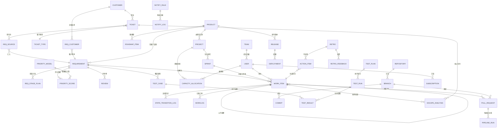
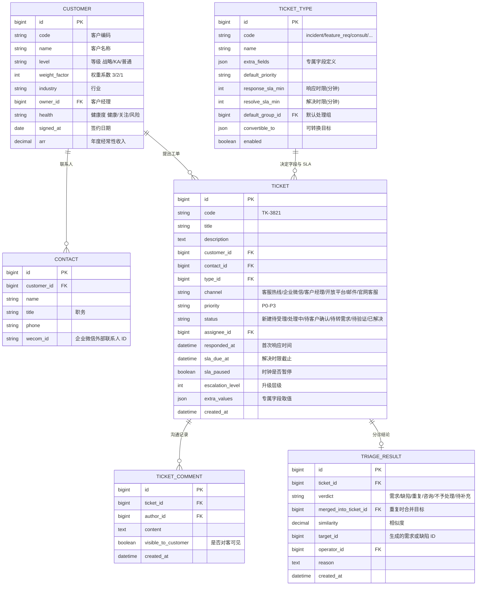
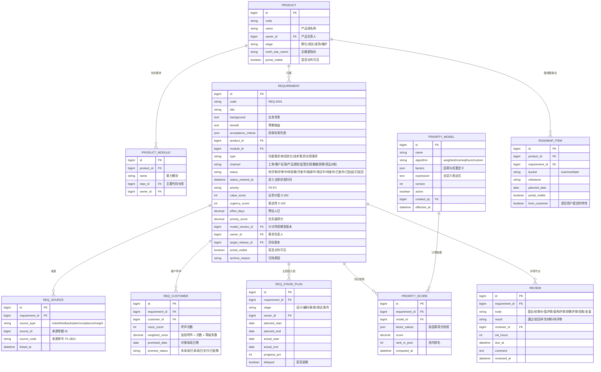
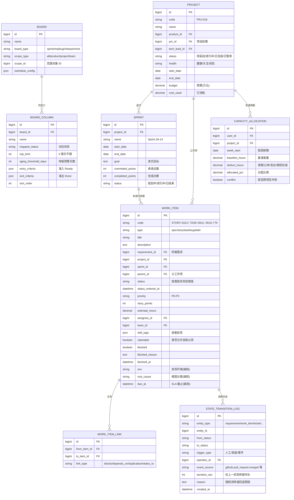
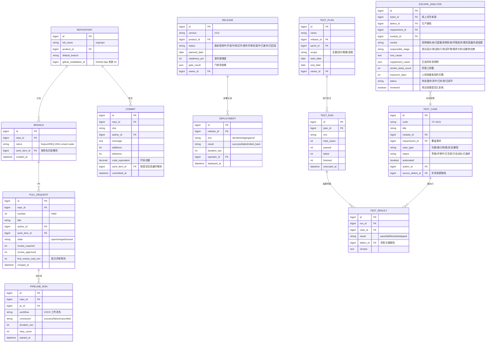
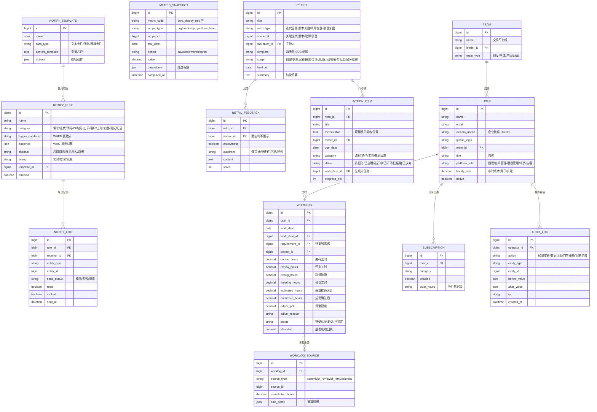

# 数据模型与 ER 图

> 配套主文档：[PRD.md](../PRD.md)。本文给出全域实体关系概览、五个子域的详细 ER 图、核心表字段字典、枚举字典与索引约束建议。

## 建模原则

1. **工作项统一建模**：用户故事、任务、缺陷、技术债在交付层的行为高度一致（都要进看板、都要流转、都要归集工时），统一落在 `work_item` 表，用 `type` 区分并挂载类型专属属性；需求（`requirement`）因为承载客户、评分、阶段计划等大量专属语义，单独建表。
2. **来源可追溯**：任何需求都能反查来源（工单 / 客户反馈 / 产品规划 / 监管合规 / 数据洞察），用 `req_source` 关联表承载多来源合并（一条需求可由多个工单合并而来）。
3. **状态与配置分离**：状态机定义（`state_machine` / `state` / `transition`）是配置数据，业务表只存当前状态码 + 进入时间，历史流转落在 `state_transition_log`。
4. **度量数据与业务数据分离**：明细表只负责事实记录，度量走 `metric_snapshot` 预聚合，避免报表查询打穿业务库。
5. **软删除与审计**：业务主表统一带 `is_deleted`、`created_by`、`created_at`、`updated_by`、`updated_at`；敏感操作额外写 `audit_log`。

---

## 一、全域实体关系概览

---

## 二、子域 ER 图

### 2.1 客户与工单域

### 2.2 产品与需求域

### 2.3 项目与交付域

### 2.4 代码、测试与发布域

### 2.5 工时、效能与协同域

---

## 三、核心表字段字典（补充说明）

字段类型与含义已在上方 ER 图中标注，此处只补充**计算字段**与**易误解字段**的口径。

### requirement

| 字段 | 口径说明 |
| --- | --- |
| `value_score` / `urgency_score` | 0-100 整数。价值来自人工打分并用收益量化自动校验；紧迫性由承诺日期与合规窗口自动推算后允许人工修正 |
| `priority_score` | 由当前生效的 `priority_model` 计算，写入时同时落 `PRIORITY_SCORE` 快照，模型升级不影响历史可复现性 |
| `effort_days` | 研发评估的人日，作为优先级算法的除数；未评估时按同类需求中位数临时填充并标记"待评估" |
| `status_entered_at` | 用于停留超时提醒与前置时间分解，状态每次变更都刷新 |
| `portal_visible` | 控制是否在业务方门户可见，默认 false，需产品负责人显式开启 |

### work_item

| 字段 | 口径说明 |
| --- | --- |
| `story_points` | 仅 `story` 与部分 `task` 使用；缺陷默认不计入迭代承诺点数（见主文档开放问题 Q4） |
| `blocked` / `blocked_at` | 阻塞是独立标记而非状态，卡片可以"在开发中且被阻塞"；阻塞时长单独统计并计入非增值时间 |
| `claimable` | 任务池自助认领开关，按工作项类型默认值：story/task/bug/debt 可认领，epic/requirement 不可 |
| `skill_tags` | 用于任务池的技能匹配推送，软校验（不阻断非匹配人员认领） |

### worklog

| 字段 | 口径说明 |
| --- | --- |
| `estimated_hours` | 系统推算结果，等于编码 + 评审 + 联调 + 会议，按 0.5 小时取整 |
| `confirmed_hours` | 成员确认值，允许相对推算值 ±30% 调整，超出需填 `adjust_reason` |
| `allocated` | 是否成功按编号归集到需求/项目；未归集的进入治理看板由负责人认领 |
| 成本换算 | 人力成本 = `confirmed_hours` × `user.hourly_cost`，团队级公开、个人级受限 |

### escape_analysis

| 字段 | 口径说明 |
| --- | --- |
| `verdict` | 六类判定之一，由反查规则自动给出，测试经理每周复核 |
| `responsible_stage` | 只到环节与团队，不落到个人（见主文档开放问题 Q5） |
| `exposure_days` | 版本发布日到线上问题首次上报日的自然日差，衡量问题暴露速度 |
| `similar_ticket_count` | 聚类到同一问题的工单数量，用于评估客户影响面 |

---

## 四、枚举字典

| 枚举组 | 取值 |
| --- | --- |
| 优先级 `priority` | P0 / P1 / P2 / P3 |
| 客户等级 `customer.level` | 战略（系数 3）/ KA（系数 2）/ 普通（系数 1） |
| 需求来源 `requirement.channel` | 工单 / 客户反馈 / 产品规划 / 监管合规 / 数据洞察 / 竞品对标 |
| 需求类型 `requirement.type` | 功能需求 / 体验优化 / 技术需求 / 合规需求 |
| 工作项类型 `work_item.type` | epic / story / task / bug / debt（测试用例独立表） |
| 工单渠道 `ticket.channel` | 客服热线 / 企业微信 / 客户经理 / 开放平台 / 邮件 / 官网客服 |
| 分诊结论 `triage.verdict` | 需求 / 缺陷 / 重复 / 咨询 / 不予处理 / 待补充信息 |
| 环境 `env` | dev / test / staging(预发) / prod(生产) |
| 项目健康度 `project.health` | 健康 / 关注 / 风险 / 已完成 / 未开始 |
| 漏测判定 `escape.verdict` | 用例缺失 / 执行遗漏 / 用例失效 / 环境差异 / 需求遗漏 / 外部因素 |
| 推送渠道 `notify.channel` | 应用消息 / 群机器人 / 两者 / 电话（仅 P0） |
| 平台角色 `user.platform_role` | 超管 / 空间管理 / 项目管理 / 成员 / 访客 |

各对象的**状态枚举**见 [状态机设计](state-machines.md)，此处不重复。

---

## 五、关键约束与索引建议

### 唯一约束

| 表 | 约束 |
| --- | --- |
| `requirement` | `code` 唯一 |
| `work_item` | `code` 唯一 |
| `ticket` | `code` 唯一 |
| `req_source` | (`requirement_id`, `source_type`, `source_id`) 唯一，防止重复关联 |
| `req_customer` | (`requirement_id`, `customer_id`) 唯一 |
| `worklog` | (`user_id`, `work_date`, `work_item_id`) 唯一，保证一人一天一工作项一条 |
| `test_result` | (`run_id`, `case_id`) 唯一 |
| `capacity_allocation` | (`user_id`, `project_id`, `week_start`) 唯一 |

### 索引

| 表 | 索引 | 支撑场景 |
| --- | --- | --- |
| `work_item` | (`project_id`, `sprint_id`, `status`) | 看板按项目/迭代/列查询 |
| `work_item` | (`assignee_id`, `status`) | 我的工作、个人负载 |
| `work_item` | (`requirement_id`) | 需求进度汇总 |
| `requirement` | (`product_id`, `status`, `priority_score` desc) | 需求池排序与筛选 |
| `ticket` | (`status`, `sla_due_at`) | SLA 预警扫描 |
| `state_transition_log` | (`entity_type`, `entity_id`, `created_at`) | 流转轨迹与停留时长计算 |
| `commit` | (`work_item_id`, `committed_at`) | 工时推算与研发上下文 |
| `metric_snapshot` | (`metric_code`, `scope_type`, `scope_id`, `stat_date`) | 度量看板查询 |
| `notify_log` | (`rule_id`, `sent_at`) | 推送效果统计 |

### 基础设施表

除业务实体外，还有四张支撑表（不在业务 ER 图中，但同样由 Flyway 建表）：

| 表 | 用途 | 关键字段 |
| --- | --- | --- |
| `state_transition_log` | 状态流转历史与停留时长（已在 2.3 节 ER 图中） | entity_type / entity_id / from_status / to_status / trigger_type / duration_sec |
| `audit_log` | 敏感操作留痕（已在 2.5 节 ER 图中） | operator_id / action / before_value / after_value / ip |
| `metric_snapshot` | 指标预聚合（已在 2.5 节 ER 图中） | metric_code / scope_type / scope_id / stat_date / period / value |
| `outbox_event` | **本地消息表**：领域事件与业务数据同事务落库，再由定时任务投递到消息队列，避免"事务提交成功但消息发送失败"导致自动化静默失效 | id / event_id(唯一) / topic / tag / shard_key(实体 ID，用于顺序消费选队列) / payload(JSON) / status(待发送/已发送/失败) / retry_count / next_retry_at / created_at / sent_at |

`outbox_event` 的约束：`event_id` 唯一；索引 `(status, next_retry_at)` 支撑定时扫描；已发送记录保留 7 天后归档清理。

### 完整性与一致性规则

1. `work_item.requirement_id` 非空时，其 `project_id` 必须与需求排期的项目一致（跨项目拆解需显式确认）。
2. 需求进入"开发中"要求至少存在一个子工作项；子工作项全部完成时需求不自动完成，仍需人工确认（避免技术完成 ≠ 业务完成）。
3. `sprint.committed_points` 在迭代开始后冻结；后续插入的工作项计入"范围变更"而不修改承诺基线。
4. 删除采用软删除；被引用的主数据（客户、产品、用户）禁止物理删除，只能停用。
5. 归档需求保留全部关联关系，复活时不重建 ID，保证历史链路连续。
