# 业务流程与流转图

> 配套主文档：[PRD.md](../PRD.md)。本文包含端到端主流程、8 个子流程泳道图、事件驱动的自动流转规则、外部系统集成时序图与异常流程。

## 图例约定

| 记号 | 含义 |
| --- | --- |
| 菱形节点 | 判断分支 |
| 双线框 / 圆角 | 系统自动执行（无需人工） |
| 泳道 subgraph | 责任角色，跨泳道的箭头即协作交接点 |
| 虚线箭头 | 异步通知或事件驱动 |

---

## 一、端到端主流程

从客户诉求到改进闭环的完整链路，也是平台的"主干道"：

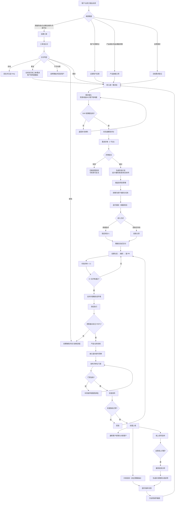

---

## 二、子流程泳道图

### 2.1 工单受理与分诊

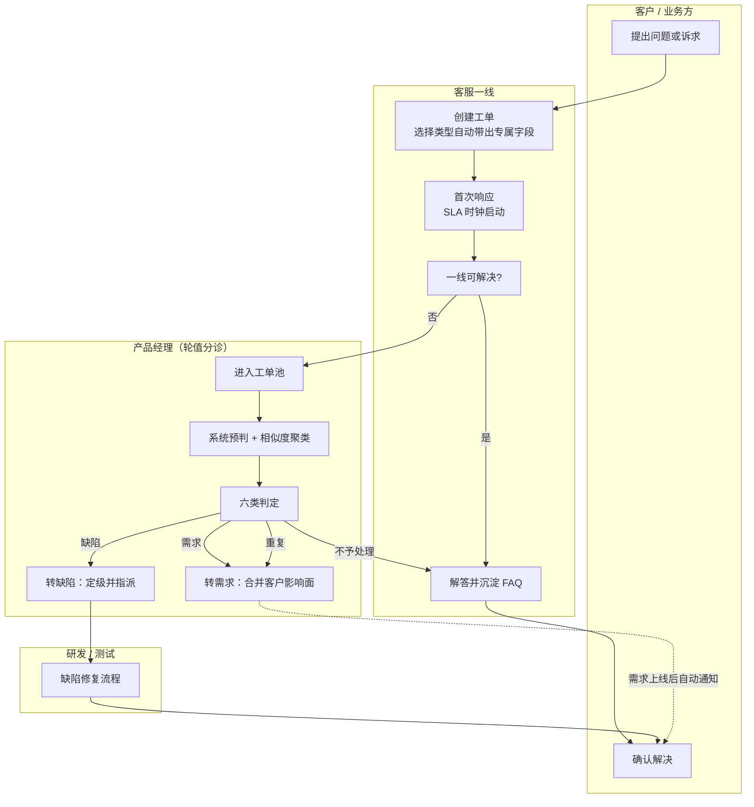

**关键规则**：分诊必须在工单创建后 1 个工作日内完成；相似度 ≥ 0.78 判定为重复并自动合并，合并后客户影响面（呼声数与加权值）叠加到主记录。

### 2.2 需求评审（7 节点）

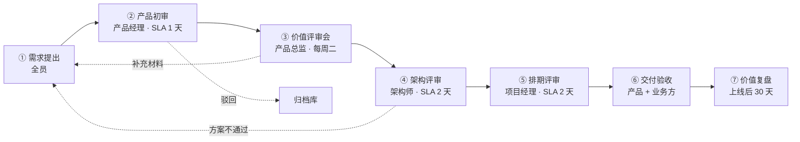

| 节点 | 参与人 | 准入 | 准出 | SLA |
| --- | --- | --- | --- | --- |
| ① 需求提出 | 全员 | 标题、描述、来源非空 | 进入需求池 | — |
| ② 产品初审 | 产品经理 | DoR 基础项达标 | 判定真需求 / 驳回 / 补充 | 1 天 |
| ③ 价值评审会 | 产品总监 + 业务方 | 已完成优先级评分 | 逐条投票形成结论 | 每周二固定会议 |
| ④ 架构评审 | 架构师 + 技术负责人 | 技术方案已提交 | 方案通过、依赖已识别 | 2 天 |
| ⑤ 排期评审 | 项目经理 | 已评估人日与容量 | 确定版本与迭代 | 2 天 |
| ⑥ 交付验收 | 产品 + 业务方 | 测试通过 | AC 逐条确认 | 随迭代 |
| ⑦ 价值复盘 | 产品 + 客户经理 | 上线满 30 天 | 对比预期收益，形成结论 | 上线后 30 天 |

### 2.3 迭代规划与任务认领

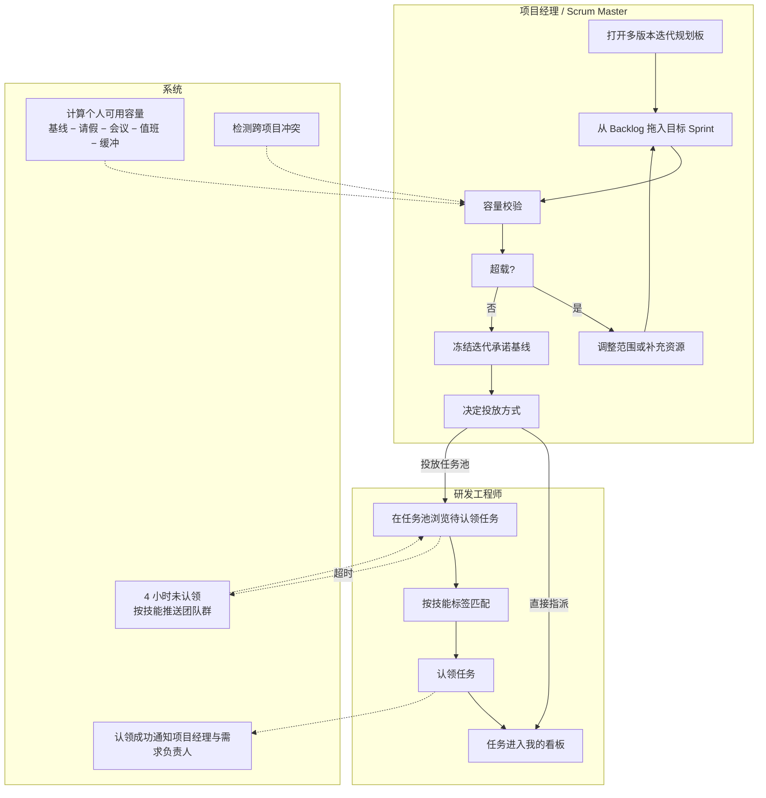

**容量公式**：`可用容量 = 基准容量 − 请假/公休 − 会议与协作 − 运维值班 − 缓冲`。排期后自动检测跨项目冲突与超载，超过 100% 实时告警。

### 2.4 看板拉动式交付

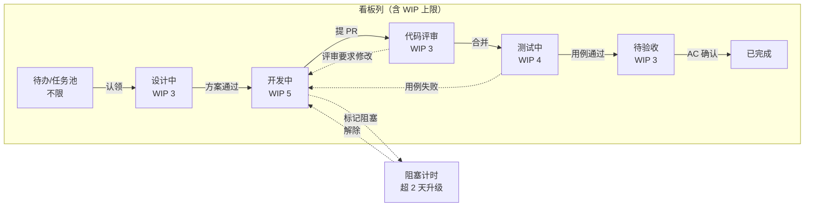

**拉动而非推送**：下游列出现空位时由下游主动拉取上游"已完成本列"的卡片（卡片显示虚线绿框拉取信号），而不是上游把活推给下游。列超出 WIP 时顶部弹出告警条并提示"停止开始，开始完成"。

### 2.5 提测到发布

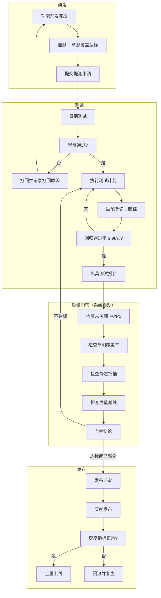

### 2.6 漏测反查（线上问题反向评估测试有效性）

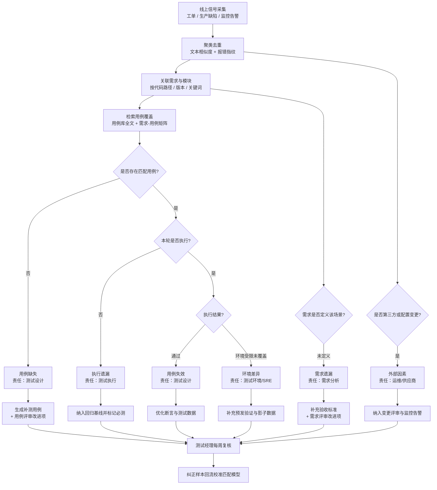

### 2.7 智能工时归集

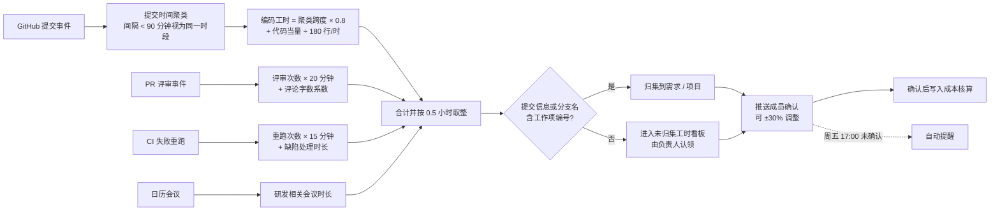

### 2.8 复盘与改进闭环

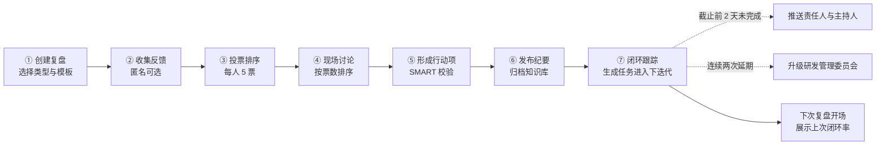

---

## 三、事件驱动的自动流转

平台的状态变更**优先由客观事件驱动**，人工流转是兜底。下图是自动流转规则全景：

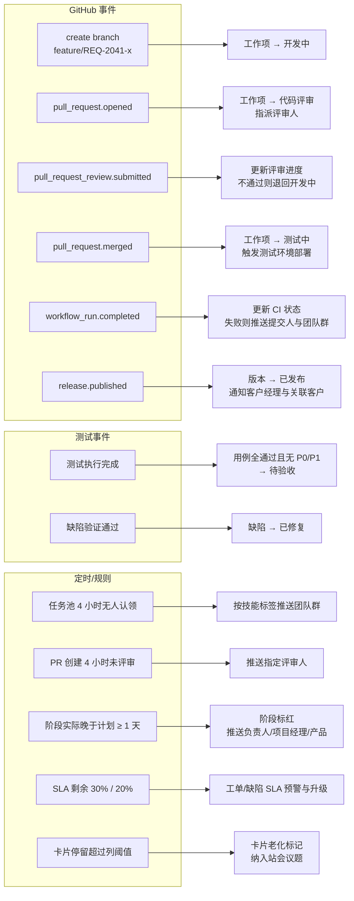

### 自动流转规则表

| 规则 | 触发事件 | 守卫条件 | 动作 | 可否关闭 |
| --- | --- | --- | --- | --- |
| AF-01 | 创建符合命名约定的分支 | 分支名可解析出工作项编号 | 工作项流转到"开发中"，记录分支 | 可（按团队） |
| AF-02 | PR 创建 | PR 标题或描述含工作项编号 | 流转到"代码评审"，按 CODEOWNERS 指派评审人，启动 4 小时 SLA | 可 |
| AF-03 | PR 评审提交 | — | 更新评审进度；`changes_requested` 时退回"开发中" | 否 |
| AF-04 | PR 合并 | CI 全绿 | 流转到"测试中"，触发测试环境部署，通知测试负责人 | 可 |
| AF-05 | 流水线完成 | — | 更新 CI 状态；失败推送提交人与团队群 | 否 |
| AF-06 | 测试执行完成 | 用例通过率 100% 且无未关闭 P0/P1 | 流转到"待验收"，通知产品 | 可 |
| AF-07 | 版本发布成功 | 门禁通过 | 版本与关联需求流转到"已发布"，通知客户经理与关联客户群 | 否 |
| AF-08 | 任务池超时 | 进入池中 > 4 小时且无人认领 | 按技能匹配推送，最多 3 次后升级项目经理 | 可 |
| AF-09 | 阶段延期 | 实际日期晚于计划 ≥ 1 天 | 标红 + 推送三方 + 计入迭代风险清单 | 否 |
| AF-10 | SLA 预警 | 剩余 30%（工单）/ 20%（缺陷） | 推送处理人与主管；归零自动升级 | 否 |
| AF-11 | 阻塞超时 | 阻塞标记超过 2 天 | 升级项目经理并纳入站会议题 | 可 |
| AF-12 | 生产缺陷关闭后复现 | 30 天内同指纹再次出现 | 自动触发漏测反查流程 | 否 |

**幂等性要求**：所有事件消费以事件 ID 去重，同一事件重复投递不产生重复流转与重复推送。

---

## 四、外部系统集成时序

### 4.1 GitHub 事件 → 工作项流转 → 企业微信推送

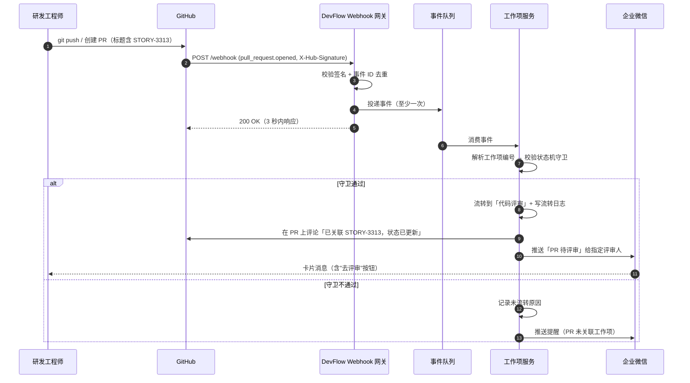

### 4.2 工单 SLA 时钟与升级

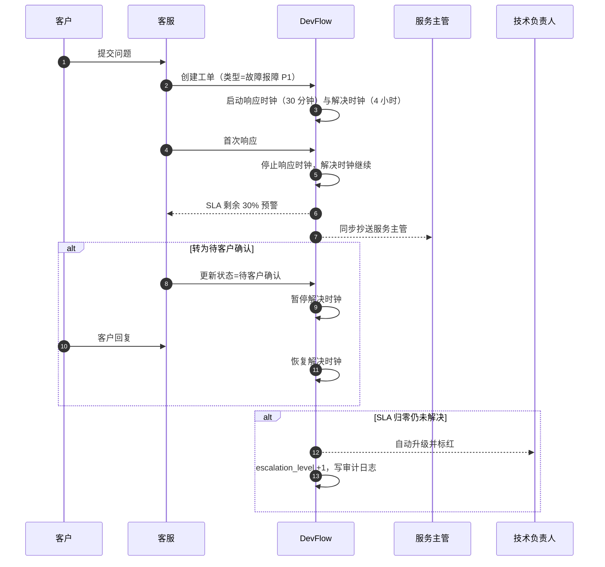

### 4.3 需求推送到项目并拆解

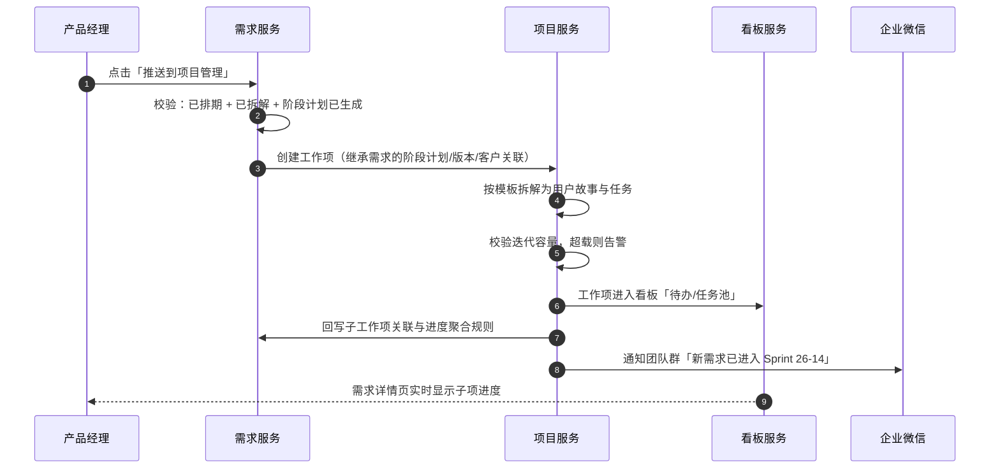

---

## 五、异常与边界流程

| 场景 | 处理方式 |
| --- | --- |
| 迭代中插入紧急需求 | 走"插入需求准入规则"：必须由产品总监审批，并明确移出等量点数的原有范围；插入记录计入范围变更率，在迭代复盘中呈现 |
| 需求范围变更 | 已冻结迭代的承诺基线不修改，变更部分单独标记；变更导致的返工工时单独统计 |
| 依赖方延期 | 在依赖图上标记，超过约定 SLA 自动升级到双方负责人；被阻塞方的卡片进入阻塞计时 |
| 生产故障（P0） | 立即拉应急群 + 电话通知；缺陷流程与常规缺陷分离走快速通道；故障恢复后 3 个工作日内完成故障复盘 |
| 发布回滚 | 版本状态流转到"已回滚"，关联需求退回"开发中"，自动创建复盘任务并冻结该版本的后续发布 |
| GitHub / 企业微信不可用 | 自动流转与推送降级：事件进入重试队列，界面提示"自动化暂停"，人工流转入口始终可用 |
| 工时数据缺失（无提交的角色） | 产品、测试、设计等角色以工作项流转事件与日历为主要来源；无法自动推算时提供手工补录入口，标记来源为"手工" |
| 成员离职 | 账号停用而非删除；其名下未完成工作项进入待重新分配队列；历史工时与贡献数据保留 |
