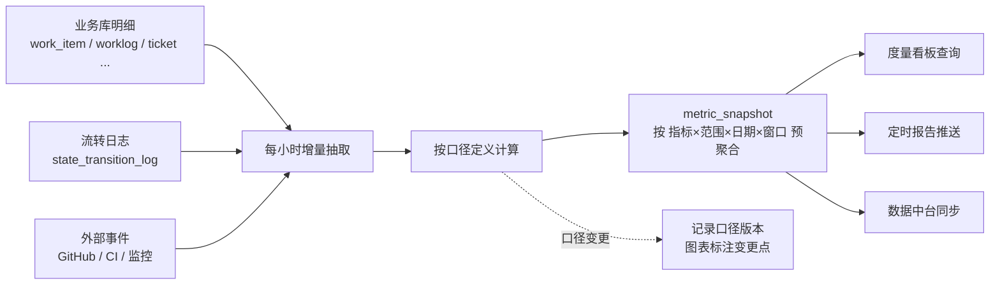

# 指标口径字典

> 配套主文档：[PRD.md](../PRD.md)。本文是平台所有度量指标的**唯一口径来源**，页面只消费不重复定义。每个指标包含定义、公式、数据来源、统计维度、更新频率与责任人。

## 使用约定

| 约定 | 说明 |
| --- | --- |
| 唯一口径 | 同名指标在任何页面含义必须一致；如需不同口径，必须另起指标名 |
| 口径可见 | 界面上每个指标都可点开查看本文对应条目 |
| 变更留痕 | 口径变更需升版本，并在图表上标注变更时间点，避免趋势断层被误读 |
| 统计维度 | 统一支持组织 / 产品线 / 项目 / 团队 / 个人五级，个人级受权限约束 |
| 时间窗 | 统一支持日 / 周 / 月 / 迭代四种窗口，默认迭代 |
| 数据延迟 | 明细实时，聚合指标按小时预计算，界面标注"数据截至时间" |

---

## 一、DORA 四项指标

| 指标 | 定义与公式 | 数据来源 | 更新频率 | 责任人 |
| --- | --- | --- | --- | --- |
| 部署频率 Deployment Frequency | 统计窗口内**生产环境**成功部署次数 ÷ 天数。回滚不计入成功部署 | `deployment`（env=prod, result=success） | 每日 | SRE |
| 变更前置时间 Lead Time for Changes | 从代码首次提交到该变更部署到生产的中位数时长。以 PR 为单位，取该 PR 首个 commit 时间到关联生产部署完成时间 | `commit` + `pull_request` + `deployment` | 每日 | SRE |
| 变更失败率 Change Failure Rate | 导致生产故障或回滚的部署次数 ÷ 总生产部署次数。"导致故障"定义为部署后 24 小时内产生 P0/P1 生产缺陷或触发回滚 | `deployment` + `work_item`(type=bug, env=prod) | 每周 | SRE + 测试经理 |
| 平均恢复时间 MTTR | 生产故障从**开始影响**到**恢复**的平均时长。开始影响以监控告警或首条工单时间为准（取较早者），恢复以缺陷状态流转到已修复且验证通过为准 | `escape_analysis` + `ticket` + `work_item` | 每周 | SRE |

**等级对照**（用于界面上的等级标注）：

| 指标 | 精英 | 高 | 中 | 低 |
| --- | --- | --- | --- | --- |
| 部署频率 | 按需（每日多次） | 每周至每月 | 每月至每半年 | 低于每半年 |
| 变更前置时间 | < 1 天 | 1 天 ~ 1 周 | 1 周 ~ 1 月 | > 1 月 |
| 变更失败率 | 0-15% | 16-30% | 31-45% | > 45% |
| MTTR | < 1 小时 | < 1 天 | 1 天 ~ 1 周 | > 1 周 |

---

## 二、交付效率指标

| 指标 | 定义与公式 | 数据来源 | 备注 |
| --- | --- | --- | --- |
| 需求前置时间 | 需求从"待评审"到"已发布"的自然日时长（P50 / P85） | `state_transition_log` | 用 P85 而非平均值做对外承诺 |
| 前置时间分解 | 各状态停留时长的构成：评审等待 / 排期等待 / 设计 / 编码 / 评审 / 测试 / 待发布 | `state_transition_log` | 用于定位瓶颈环节 |
| 周期时间 Cycle Time | 工作项从进入"开发中"到进入"已完成"的时长（P50 / P85） | `state_transition_log` | 看板散点图的纵轴 |
| 吞吐量 Throughput | 统计窗口内完成的工作项数量与故事点数 | `work_item` | 项数与点数分别统计，避免只看点数被估算通胀影响 |
| 流动效率 Flow Efficiency | 增值时间 ÷ 总周期时间。增值时间 = 处于"进行"类状态的时长；等待类状态与阻塞时长为非增值 | `state_transition_log` | 行业经验值普遍在 15%-40%，低于 25% 说明等待浪费严重 |
| 在制品 WIP | 处于"进行"与"等待"状态的工作项数量（不含待办与已完成） | `work_item` | 按列与按人两个维度统计 |
| 迭代承诺达成率 | 迭代结束时完成的承诺点数 ÷ 迭代开始时冻结的承诺点数 | `sprint` + `work_item` | 迭代中插入的范围不计入分母，单独统计范围变更率 |
| 范围变更率 | 迭代开始后新增或移出的点数 ÷ 承诺点数 | `sprint` + 范围变更记录 | 高于 20% 说明规划或准入有问题 |
| 准时交付率 | 按承诺日期交付的需求数 ÷ 有承诺日期的需求数 | `req_customer.promised_date` | 只统计有对客承诺的需求 |
| 阶段延期率 | 存在任一阶段延期 ≥ 1 天的需求数 ÷ 有阶段计划的需求数 | `req_stage_plan` | 按阶段拆分展示，定位最常延期的环节 |
| PR 首次评审等待 | PR 创建到首次评审提交的时长（P50 / P85） | `pull_request` | 团队约定 4 小时内首响 |
| 卡片老化 | 当前在制卡片在所在列的停留天数分布 | `work_item.status_entered_at` | 看板上以绿/黄/红徽标呈现（≤2 / 3-4 / >4 天） |

---

## 三、质量指标

| 指标 | 定义与公式 | 数据来源 | 备注 |
| --- | --- | --- | --- |
| 缺陷密度 | 统计窗口内新增缺陷数 ÷ 交付故事点数 | `work_item` | 按产品线与模块对比，不做跨团队排名 |
| 缺陷逃逸率（漏测率） | 逃逸缺陷数 ÷（测试阶段发现缺陷数 + 逃逸缺陷数） | `work_item` + `escape_analysis` | 逃逸定义为发现环境 = 生产 |
| 漏测判定分布 | 六类判定（用例缺失 / 执行遗漏 / 用例失效 / 环境差异 / 需求遗漏 / 外部因素）的占比 | `escape_analysis.verdict` | 只公开到环节与团队，不到个人 |
| 平均暴露时长 | 版本发布日到线上问题首次上报日的自然日均值 | `escape_analysis.exposure_days` | 衡量线上问题被发现的速度 |
| 缺陷修复时长 | 缺陷从"已确认"到"已修复"的时长（按 P0-P3 分别统计） | `state_transition_log` | 与 SLA 时限对比 |
| 缺陷重开率 | 重开次数 ≥ 1 的缺陷数 ÷ 已关闭缺陷数 | `work_item` + 流转日志 | 重开 ≥ 2 次进入质量风险清单 |
| 返工率 | 从"测试中"退回"开发中"的次数 ÷ 进入测试中的次数 | `state_transition_log` | 反映提测质量 |
| 用例覆盖率 | 已被至少一条用例覆盖的验收标准数 ÷ 验收标准总数 | `test_case` + `requirement.acceptance_criteria` | 需求粒度统计 |
| 自动化率 | 自动化用例数 ÷ 生效用例数 | `test_case.automated` | 分层统计（接口 / UI） |
| 回归通过率 | 本轮通过用例数 ÷ 执行用例数 | `test_run` | 发布门禁阈值 98% |
| 门禁豁免次数 | 统计窗口内的发布门禁豁免次数与豁免项分布 | `release.gate_result` + 审计日志 | 豁免必须在版本复盘中回顾 |

---

## 四、工时与成本指标

| 指标 | 定义与公式 | 数据来源 | 备注 |
| --- | --- | --- | --- |
| 推算工时 | `编码 + 评审 + 联调 + 会议`，按 0.5 小时取整。编码 = 提交聚类跨度 × 0.8 + 代码当量 ÷ 180 行/时 | `worklog` + `worklog_source` | 算法参数可按团队差异化配置 |
| 工时归集率 | 成功归集到需求/项目的工时 ÷ 总推算工时 | `worklog.allocated` | 目标 ≥ 90%，低于阈值提示数据质量风险 |
| 推算准确度 | 1 − 平均\|确认工时 − 推算工时\| ÷ 确认工时 | `worklog` | 用成员确认结果持续校准算法 |
| 成员调整率 | 调整幅度超过 10% 的工时记录数 ÷ 总记录数 | `worklog.adjust_pct` | 调整率持续偏高说明算法需校准 |
| 工时确认及时率 | 在周五 17:00 前确认的工时记录数 ÷ 应确认数 | `worklog.status` | 影响成本核算的时效 |
| 人力成本 | Σ(`confirmed_hours` × `user.hourly_cost`) | `worklog` + `user` | 按产品线 / 项目 / 需求三个维度分摊 |
| 需求单位成本 | 需求累计人力成本 ÷ 需求交付的故事点 | `worklog` + `work_item` | 用于横向对比复杂度相近的需求 |
| 投入结构 | 新功能 / 缺陷修复 / 技术债 / 运维支持四类工时占比 | `worklog` + `work_item.type` | 健康区间参考：新功能 55-70%，技术债 10-20% |
| 容量饱和度 | 已分配工时 ÷ 可用容量。可用容量 = 基线 − 请假/公休 − 会议与协作 − 运维值班 − 缓冲 | `capacity_allocation` | 超过 100% 实时告警 |

---

## 五、人效与贡献指标

> 这一组指标的使用有明确边界：**用于能力发展、工作分配与组织风险识别，不作为绩效考核的唯一依据**，个人级明细仅本人与直属主管可见。

| 指标 | 定义与公式 | 数据来源 | 备注 |
| --- | --- | --- | --- |
| 交付量 | 完成的故事点数与工作项数 | `work_item` | 不同类型工作项权重不同，避免只刷小任务 |
| 质量贡献 | 1 − (个人产出中逃逸缺陷数 ÷ 个人交付工作项数) 归一化 | `work_item` + `escape_analysis` | 只到团队与环节的漏测归因不下沉到个人，此处仅用个人产出的缺陷数 |
| 评审贡献 | 参与的 PR 评审次数 × 评审质量系数（有效评论数） | `pull_request` | 鼓励评审而不只是写代码 |
| 协作广度 | 协作过的项目数与跨团队协作次数 | `work_item` + `pull_request` | 识别桥梁型成员 |
| 稳定性 | 交付量的周度波动系数（标准差 ÷ 均值），越低越稳定 | `work_item` | 不追求越高越好，只作参考 |
| 复杂度 | 承担工作项的平均故事点与技术难度标签加权 | `work_item` | 避免"完成数多但都是简单任务"被误读为高产 |
| 产品贡献率 | 个人在某产品线的归集工时（或交付点数）÷ 该产品线总量 | `worklog` + `work_item` | 同一人可在多条产品线有贡献，各产品线内部合计为 100% |
| 单点依赖度 | 某模块中单一成员的提交占比。≥ 80% 判定为单点依赖 | `commit` + `product_module` | 触发结对、轮岗、补文档等建议 |
| 人均交付 | 团队交付点数 ÷ 团队有效人力（按容量折算，非人头数） | `work_item` + `capacity_allocation` | 跨团队对比时必须同时看复杂度与质量 |

---

## 六、客户与业务指标

| 指标 | 定义与公式 | 数据来源 | 备注 |
| --- | --- | --- | --- |
| 客户呼声数 | 关联到某需求的客户数量 | `req_customer` | 去重后的客户数，非工单数 |
| 加权呼声 | Σ(客户呼声次数 × 客户等级系数)，战略 ×3 / KA ×2 / 普通 ×1 | `req_customer` + `customer.weight_factor` | 用于需求排序的客户权重因素 |
| 工单 SLA 达标率 | SLA 内解决的工单数 ÷ 已解决工单数 | `ticket` | 响应与解决分别统计 |
| 工单转化率 | 转为需求或缺陷的工单数 ÷ 分诊完成的工单数 | `triage_result` | 过低说明工单质量差，过高说明产品缺陷多 |
| 工单重复率 | 判定为重复的工单数 ÷ 分诊完成的工单数 | `triage_result` | 高重复率提示需要沉淀 FAQ 或修复共性问题 |
| 对客承诺达成率 | 按承诺日期交付的需求数 ÷ 有承诺日期的需求数 | `req_customer.promise_status` | 与准时交付率口径一致，按客户维度展示 |
| 需求价值达成 | 上线 30 天后实际收益 ÷ 立项时的预期收益 | 价值复盘记录 | 只统计有可量化收益定义的需求 |
| 门户活跃度 | 门户周活跃业务方数 ÷ 应覆盖业务干系人数 | 埋点 | 衡量"进度自动可见"目标的达成 |

---

## 七、平台自身健康指标

用于评估平台建设本身是否达成目标（对应主文档 1.3 成功指标）。

| 指标 | 定义 | 目标 |
| --- | --- | --- |
| 自动流转成功率 | 事件触发的自动流转成功次数 ÷ 应触发次数 | ≥ 98% |
| 事件处理延迟 | GitHub 事件到达至状态更新可见的时长 P95 | ≤ 3 秒 |
| 推送打开率 | 推送消息被点击或已读的比例（按规则统计） | 关键规则 ≥ 60% |
| 漏测自动判定准确率 | 测试经理复核后维持原判的比例 | ≥ 85% |
| DoR 达标率 | 进入评审时 DoR 全项达标的需求比例 | ≥ 80% |
| 必填字段缺失率 | 关键字段（收益、AC、来源、工作量）缺失的需求比例 | ≤ 10% |
| 未归集工时占比 | 未能归集到需求/项目的工时占比 | ≤ 10% |
| 功能采纳度 | 各页面与关键功能的周活跃使用人数 | 无人使用的功能进入下线评估 |

---

## 八、指标计算与存储

**设计要点**：

1. 度量查询一律走 `metric_snapshot`，不直接查明细表，避免报表拖垮业务库。
2. 口径变更不回刷历史快照（历史数据保持当时口径），只在图表上标注变更时间点，防止趋势被"改口径"人为改善。
3. 个人级指标在快照层就按权限打标，查询时二次校验，避免越权。
4. 所有指标必须能从快照下钻到明细清单，否则无法取信于人。
