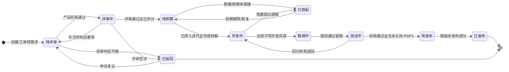
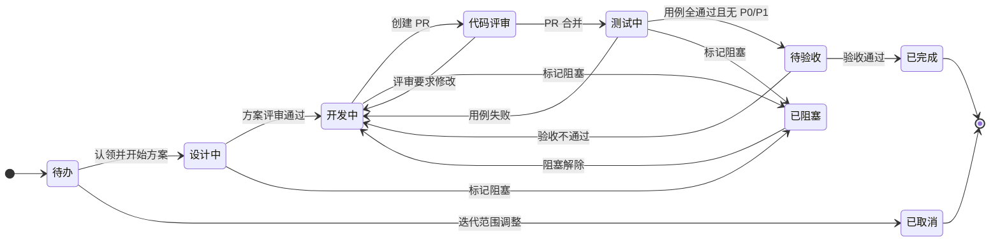
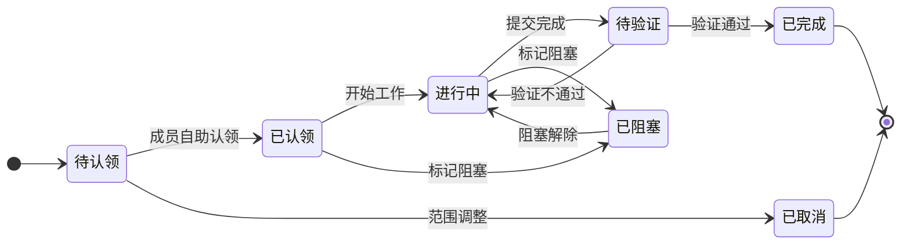
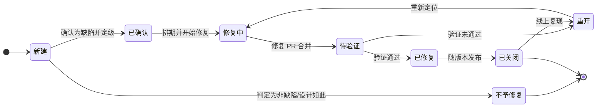
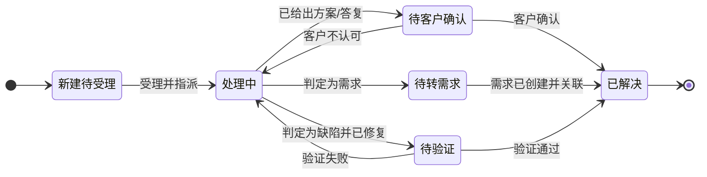
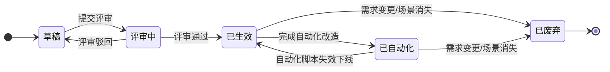
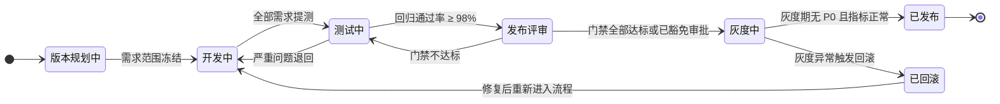
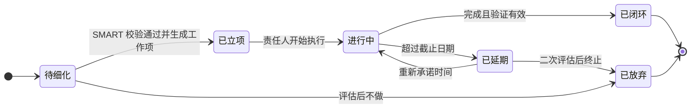

# 状态机设计

> 配套主文档：[PRD.md](../PRD.md)。本文定义平台内 8 类对象的状态机。所有状态名与原型 `settings.html`、`board.html`、`ticket.html` 中的实现一致。

## 通用约定

| 约定 | 说明 |
| --- | --- |
| 状态归类 | 每个状态归入 `初始` / `进行` / `等待` / `终态` 之一；等待态计入"非增值时间"，用于流动效率计算 |
| 转换要素 | 每条转换由 `触发（Trigger）+ 守卫（Guard）+ 动作（Action）` 三部分定义 |
| 触发来源 | `人工`（用户操作）、`系统`（定时或规则）、`事件`（GitHub / CI / 工单等外部事件） |
| 守卫失败 | 转换被拦截，界面给出具体未满足项，不静默失败 |
| 逆向流转 | 除明确定义的回退路径外一律禁止；管理员强制流转需填写原因并写入审计日志 |
| 状态计时 | 进入状态即开始计时，用于卡片老化、SLA、停留超时提醒 |
| 配置化 | 状态、颜色、流转规则、超时阈值均可在 `settings.html` 中按工作项类型配置，新增状态不需要发版 |

---

## 一、需求 Requirement

需求是平台的核心对象，主流程 8 态 + 2 个异常态。

### 状态字典

| 状态 | 归类 | 含义 | 停留超时提醒 | 可操作角色 |
| --- | --- | --- | --- | --- |
| 待评审 | 初始 | 已录入需求池，等待产品初审 | 2 天 | 产品经理、产品总监 |
| 评审中 | 进行 | 价值评审 / 架构评审进行中 | 3 天 | 架构师、产品总监、总裁 |
| 待排期 | 等待 | 评审通过，等待进入版本与迭代 | 5 天 | 项目经理、产品总监 |
| 开发中 | 进行 | 已拆解并进入迭代，子项在交付 | 按迭代 | 研发负责人、经办人 |
| 联调中 | 进行 | 内部联调与依赖方对接 | 3 天 | 研发负责人 |
| 测试中 | 进行 | 已提测，测试与验收进行中 | 3 天 | 测试工程师、测试经理 |
| 待发布 | 等待 | 验收通过，等待发布窗口 | 2 天 | SRE、测试经理 |
| 已发布 | 终态 | 已随版本上线 | — | 系统 |
| 已挂起 | 等待 | 暂缓推进，保留在池中 | 14 天复议 | 产品总监 |
| 已驳回 | 终态 | 判定不做，进入归档库可检索复活 | — | 产品总监 |

### 转换表

| # | 起 → 止 | 触发 | 守卫条件 | 动作 |
| --- | --- | --- | --- | --- |
| R1 | — → 待评审 | 人工 / 事件（工单转需求） | 标题、描述、来源渠道非空 | 生成 REQ 编号；回写来源工单关联；进入分诊队列 |
| R2 | 待评审 → 评审中 | 人工 | DoR 达标（背景清晰、收益可量化、AC ≥ 3 条、已关联来源、已评分） | 创建评审单；推送评审人；启动评审 SLA |
| R3 | 待评审 → 已驳回 | 人工 | 必须填写驳回理由 | 归档；若来源为工单则回复客户 |
| R4 | 评审中 → 待排期 | 人工 | 评审结论为通过 + 优先级得分已生成 | 写入得分快照与模型版本；进入排期池 |
| R5 | 评审中 → 待评审 | 人工 | 评审结论为"补充材料" | 记录待补项；通知提出人 |
| R6 | 待排期 → 开发中 | 人工 / 系统 | 已关联目标版本与迭代 + 已拆解为子工作项 + 阶段计划已生成 | 创建故事/任务；推送团队群；开始阶段计时 |
| R7 | 开发中 → 联调中 | 系统 | 所有子工作项状态 ≥ 代码评审 | 更新阶段实际开始；通知依赖方 |
| R8 | 联调中 → 测试中 | 人工 / 事件 | 冒烟用例通过 + 测试环境就绪 | 生成测试任务；推送测试负责人与测试群 |
| R9 | 测试中 → 待发布 | 人工 | 回归通过率达标 + 无未关闭 P0/P1 + 验收通过 | 计入版本发布清单 |
| R10 | 测试中 → 开发中 | 事件 | 回归失败或新增 P0/P1 | 回退并记录返工原因，计入返工率 |
| R11 | 待发布 → 已发布 | 事件（发布成功） | 版本门禁通过 | 更新阶段实际完成；推送客户经理与关联客户群；触发价值复盘任务 |
| R12 | 任意进行态 → 已挂起 | 人工 | 填写挂起原因与预计恢复时间 | 停止阶段计时；14 天后自动提醒复议 |
| R13 | 已挂起 → 待排期 | 人工 / 系统 | 阻塞原因已解除 | 重新计算优先级得分（模型可能已升级） |
| R14 | 已驳回 → 待评审 | 人工 | 申诉复议通过 | 从归档库复活，保留历史记录 |

---

## 二、用户故事 Story

### 列策略（准入 Ready / 准出 Done）

看板上每一列的准入准出条件必须显性化，点击列头 `?` 可查看：

| 状态（看板列） | WIP 上限 | 准入 Ready | 准出 Done |
| --- | --: | --- | --- |
| 待办 / 任务池 | 不限 | 需求已就绪、AC 明确、依赖已识别 | 已被认领且经办人明确 |
| 设计中 | 3 | 已认领；有明确的方案产出目标 | 技术方案评审通过并归档 |
| 开发中 | 5 | 方案已定；分支已创建 | 本地自测通过 + 单测覆盖达标 + PR 已提交且 CI 全绿 |
| 代码评审 | 3 | PR 已创建且 CI 通过 | 至少 2 位评审通过且评论已闭环 |
| 测试中 | 4 | PR 已合并；测试环境已部署 | 关联用例全部通过，无未关闭 P0/P1 |
| 待验收 | 3 | 测试通过；演示环境可用 | 产品/业务验收确认，AC 逐条勾选完成 |
| 已完成 | 不限 | 验收通过 | 随版本发布后自动归档 |

### 转换表（关键项）

| # | 起 → 止 | 触发 | 守卫 | 动作 |
| --- | --- | --- | --- | --- |
| S1 | 待办 → 设计中/开发中 | 人工（认领） | 认领人具备所需技能标签（软校验，仅提示） | 分配经办人；通知项目经理与需求负责人；从任务池移除 |
| S2 | 开发中 → 代码评审 | 事件（GitHub `pull_request.opened`） | PR 描述含工作项编号 | 自动流转；指派评审人；启动 4 小时评审 SLA |
| S3 | 代码评审 → 测试中 | 事件（`pull_request.closed` 且 merged） | CI 全绿 | 自动流转；触发测试环境部署；通知测试负责人 |
| S4 | 测试中 → 待验收 | 事件（测试执行完成） | 用例通过率 100% 且无未关闭 P0/P1 | 自动流转；通知产品验收 |
| S5 | 任意 → 已阻塞 | 人工 | 必须填写阻塞原因与依赖方 | 开始阻塞计时；卡片显示斑马纹；超 2 天升级至项目经理 |
| S6 | 待验收 → 已完成 | 人工 | AC 全部勾选 | 计入迭代完成点数；更新燃尽图 |

---

## 三、任务 Task

**任务池规则**：任务进入"待认领"超过 4 小时无人认领，按技能标签匹配推送到团队群与匹配成员（每 4 小时一次，最多 3 次），仍无人认领则升级至项目经理指派。

---

## 四、缺陷 Bug

### 严重程度与 SLA

| 级别 | 定义 | 首次响应 | 修复时限 | 升级规则 |
| --- | --- | --- | --- | --- |
| P0 | 生产核心链路不可用、资损、合规风险 | 15 分钟 | 4 小时 | 立即拉应急群 + 电话通知总裁与技术负责人 |
| P1 | 主要功能受损、影响多客户 | 30 分钟 | 1 个工作日 | SLA 剩余 20% 时推送处理人与测试负责人 |
| P2 | 次要功能异常、有绕行方案 | 4 小时 | 3 个工作日 | 超时推送团队负责人 |
| P3 | 体验问题、文案错误 | 1 个工作日 | 纳入版本计划 | 不单独升级 |

**重开规则**：同一缺陷重开 ≥ 2 次自动标记为"质量风险项"，进入迭代复盘议题；生产环境缺陷关闭后 30 天内复现，自动触发漏测反查流程。

---

## 五、工单 Ticket

### 工单类型与默认 SLA

| 类型 | 编码 | 专属字段 | 默认优先级 · 响应/解决 | 默认处理组 | 可转换目标 |
| --- | --- | --- | --- | --- | --- |
| 故障报障 | `incident` | 影响范围 / 复现步骤 / 发生时间 / 日志附件 | P1 · 30 分钟 / 4 小时 | 按模块自动分派 | 缺陷 · 项目 |
| 需求建议 | `feature_req` | 业务场景 / 期望效果 / 涉及门店数 / 影响金额 | P2 · 2 小时 / 1 天 | 产品部 | 需求 |
| 使用咨询 | `consult` | 咨询模块 / 已尝试操作 | P3 · 1 天 / 3 天 | 客服一线 | 知识库 |
| 数据订正 | `data_fix` | 订正范围 / 数据依据 / 授权人 / 影响金额 | P2 · 2 小时 / 1 天 | 交易平台组 | 缺陷 · 项目 |
| 投诉 | `complaint` | 投诉对象 / 诉求 / 期望补偿 | P1 · 30 分钟 / 4 小时 | 服务主管 | 需求 · 缺陷 |
| 合规与安全事件 | `compliance` | 监管条款 / 上报时限 / 涉及主体 | P0 · 15 分钟 / 1 小时 | 风控算法组 | 需求 · 项目 |
| 开放平台接入 | `openapi` | 应用 ID / 接口列表 / 环境 | P2 · 2 小时 / 1 天 | 技术架构组 | 需求 |

### SLA 时钟规则

- **时钟启动**：工单创建即启动响应时钟；受理后启动解决时钟。
- **时钟暂停**：进入"待客户确认"暂停解决时钟，客户回复后恢复（避免因客户不回复而误判超时）。
- **预警**：SLA 剩余 30% 推送处理人与服务主管；剩余 0% 自动升级至技术负责人并标红。
- **分诊判定**：工单池中按六类判定处理——需求 / 缺陷 / 重复（相似度 ≥ 0.78 合并且客户影响面叠加）/ 咨询（沉淀 FAQ）/ 不予处理（说明理由并回复）/ 待补充信息。

---

## 六、测试用例 Case

**补测用例规则**：漏测反查判定为"用例缺失"时自动生成草稿态补测用例，标记来源缺陷与责任环节，必须在下一个迭代内完成评审并生效，否则进入质量风险清单。

---

## 七、版本发布 Release

### 发布门禁

| 门禁项 | 达标标准 | 不达标处理 |
| --- | --- | --- |
| 回归通过率 | ≥ 98% | 阻断，需补测 |
| 未关闭 P0/P1 缺陷 | 0 个 | 阻断 |
| 单测覆盖率 | 不低于基线 −2pt | 阻断，可豁免（超管审批） |
| 静态扫描严重问题 | 0 个 | 阻断 |
| 性能基线 | 关键接口 P95 不劣化 > 10% | 告警 + 豁免审批 |
| 变更评审 | 高风险变更已评审并有回滚方案 | 阻断 |

**豁免机制**：门禁豁免需超管审批，记录豁免项、理由、责任人与生效版本，并自动纳入下一次版本复盘议题。

---

## 八、复盘行动项 Action Item

**SMART 校验**：行动项必须同时满足具体（描述明确动作）、可衡量（有验收信号）、有责任人（单一责任人而非团队）、相关（对应本次复盘问题）、有截止日期，五项缺一不可提交。

**闭环跟踪**：行动项自动生成对应任务工作项并进入下一迭代；截止前 2 天未完成推送责任人与主持人；连续两次延期升级至研发管理委员会。上一次复盘的行动项闭环率会在下一次复盘开场自动展示。

---

## 附：状态操作权限

状态操作权限独立于全局角色矩阵配置，同一状态只有指定角色可以推动流转：

| 对象 | 状态 | 可操作角色 | 停留超时提醒 |
| --- | --- | --- | --- |
| 需求 | 待评审 | 产品经理、产品总监 | 2 天 |
| 需求 | 评审中 | 架构师、产品总监、总裁 | 3 天 |
| 需求 | 待排期 | 项目经理、产品总监 | 5 天 |
| 需求 | 开发中 | 研发负责人、经办人 | 按迭代 |
| 需求 | 测试中 | 测试工程师、测试经理 | 3 天 |
| 需求 | 待发布 | SRE、测试经理 | 2 天 |
| 缺陷 | 新建 | 测试工程师、研发负责人 | 4 小时 |
| 版本 | 发布评审 | SRE、测试经理、超管（豁免） | 1 天 |

**强制流转**：超管可强制流转任意状态，但必须填写原因，操作写入审计日志并在工作项时间线上永久标记"管理员强制流转"。
